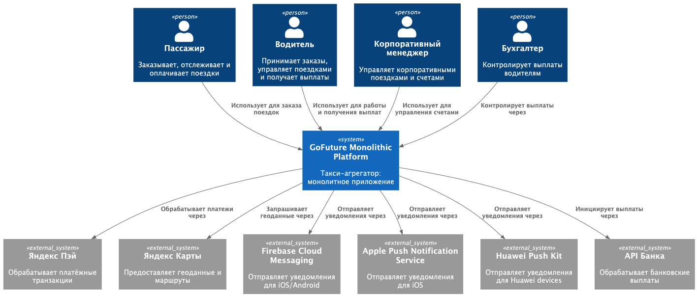
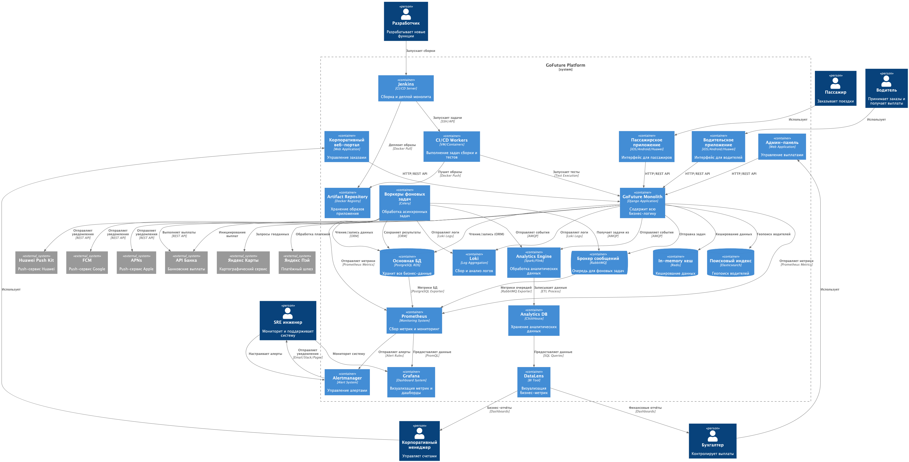
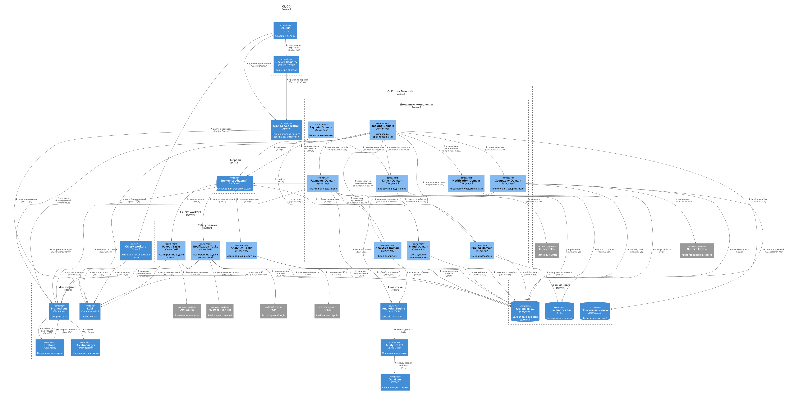

# Описание кейса

В итоговом спринте вы будете работать над кейсом компании «GoFuture».

## О компании

«GoFuture» — это платформа для агрегирования такси, у которой есть пассажирское и водительское приложения, а также
веб-портал для корпоративных клиентов.

Компания столкнулась с критическими ограничениями монолитной архитектуры. Та просто не справляется с масштабированием
при активной экспансии на рынки Юго-Восточной Азии и Южной Америки. Пиковые нагрузки (более 100 тысяч активных поездок)
вызывают каскадные отказы, разработка новых функций затягивается минимум на полгода, а среднее время восстановления (
MTTR) превышает четыре часа.

## Ключевые бизнес-требования

- Обработка 500 тысяч конкурентных поездок.
- Горизонтальное масштабирование сразу в нескольких географических регионах.
- Обеспечение 99,95% доступности критических сервисов.
- Сокращение времени выхода на рынок новых функций до двух недель.
- Соответствие локальным регуляторным требованиям.
- Поддержка динамического ценообразования в режиме реального времени.
- Оптимизация загрузки водителей в часы пик с помощью «умного» перераспределения (ожидание подходящего водителя вместо
  выбора ближайшего, чтобы избежать «горячих зон», где концентрируется большинство водителей).
- Интеграция с локальными платёжными и картографическими сервисами.

## Лендскейп компании

Текущая организационная структура «GoFuture» выглядит так:

- Восемь продуктовых команд по доменам — Booking, Driver, Pricing, Payments, Notification, Geography, Analytics и Fraud.
- Платформенная команда отвечает за CI/CD, Observability и Developer Tooling.
- SRE-команда отвечает за надёжность, планирование ёмкости и управление инцидентами.
- Data-инженеры занимаются аналитикой в режиме реального времени, ML-пайплайнами и data governance.
- Архитектурный комитет формирует техническую стратегию и стандарты, а также проводит code review.
- Инфраструктурная команда управляет оборудованием, VMware, Docker и выполняет ручное масштабирование по алертам.

## Какие технологии и системы используются

### Основной стек приложения

- Backend Framework — Django (Python).
- Task Queue — Celery.
- Message Broker — RabbitMQ.
- Application Server — Gunicorn/uWSGI.
- API — REST API.

### Базы данных и хранилища

- Основная БД — PostgreSQL RDS.
- Поисковый движок — Elasticsearch.
- Кеширование — Redis.
- Аналитическая БД — ClickHouse.
- Хранилище образов — Docker Registry.

### Инфраструктура и платформа

- Cloud Provider — Yandex Cloud.
- Compute — EC2 instances.
- Containerization — Docker.
- Orchestration — Docker Compose (базовое).
- Load Balancing — AWS ELB/ALB.

### Мониторинг и observability

- Метрики — Prometheus.
- Визуализация — Grafana.
- Логи — Loki.
- Алертинг — Alertmanager.
- Метрики БД — PostgreSQL Exporter.
- Метрики очередей — RabbitMQ Exporter.

### CI/CD-пайплайн

- CI/CD Server — Jenkins.
- Сборка — Docker builds.
- Артефакты — Docker Registry.
- Воркеры сборки — VM/Containers.
- Деплой — Docker-based deployment.

### Аналитика и BI

- Обработка данных — Spark/Flink.
- Хранилище данных — ClickHouse.
- BI-инструмент — DataLens.
- Data pipelines — ETL-processes.

### Внешние интеграции и API

- Платёжный шлюз — Яндекс Пэй.
- Картографический сервис — Яндекс Карты.
- Push-уведомления — Firebase Cloud Messaging (FCM) для Android, Apple Push Notification Service (APNS) для iOS и Huawei
  Push Kit для Huawei-устройств.
- Банковские API — интеграции с банками для выплат.

### Клиентские приложения

#### Мобильные приложения

- iOS Native (Swift/Objective-C).
- Android Native (Kotlin/Java).
- Huawei Mobile Services.

#### Веб-приложения

- Корпоративный портал (React/Vue.js и Django).
- Админ-панель (Django Admin).

### Сетевые протоколы и коммуникация

- Синхронные вызовы — HTTP/REST.
- Асинхронные вызовы — AMQP (RabbitMQ).
- Метрики — Prometheus Metrics.
- Логи — Loki Logs API.
- Базы данных — SQL, ORM и прямые подключения.

### Вспомогательные инструменты

- Миграции БД — Django Migrations.
- Кеширование — Redis.
- Геопоиск — геозапросы в Elasticsearch.
- Очереди задач — Celery Beat для планирования и выполнения периодических задач.
- Конфигурация — переменные окружения и конфигурационные файлы.

## Ключевые характеристики стека

Архитектура системы «GoFuture» монолитна. Используется единая кодовая база на Django. Все сервисы работают с одной базой
данных PostgreSQL. В реализации применяются смешанные паттерны — синхронные вызовы сочетаются с асинхронными задачами.

Мобильные приложения разрабатываются нативно и отдельно для iOS и Android. Мониторинг реализован на базе Prometheus и
Grafana, но без сложных настроек. Масштабирование осуществляется вертикально за счёт увеличения ресурсов EC2-инстансов и
вручную по алертам, без автоматического скейлинга. Сборки занимают более 30 минут из-за монолитной структуры проекта.

Такой стек отражает типичную эволюцию стартапа, начавшего с монолита и постепенно добавлявшего инструменты по мере
роста, но без фундаментального пересмотра архитектуры.

## Диаграмма системы

Ключевые взаимодействия (аналогичны целевым, но реализованы внутри монолита):

Пассажиры и водители взаимодействуют через мобильное приложение. Корпоративные клиенты используют веб-портал. Система
интегрирована со сторонними сервисами, включая платёжные шлюзы, карты и push-уведомления.

### Текущий контекст (C1)

Диаграмма в формате `.puml`  [C1.puml](monolith_diagrams/puml/C1.puml).

### Уровень контейнеров (C2)

Диаграмма в формате `.puml` [C2.puml](monolith_diagrams/puml/C2.puml).

### Уровень компонентов (С3)

Диаграмма в формате `.puml` [C3.puml](monolith_diagrams/puml/C3.puml).

## Цели бизнеса

Достигнуто динамическое ценообразование с реалтайм-адаптацией цен на основе спроса и предложения. Оптимизирована
загрузка водителей для предотвращения «горячих точек». Платформа «GoFuture» стала мультитенантной, поддерживая партнёров
в новых регионах. Используются data-driven решения: ML-модели для прогнозирования спроса и предотвращения фрода.
Реализована возможность самообслуживания через API для внешних разработчиков и партнёров.

В итоге это дало и свой бизнес-импакт, так что ускорен выход на новые рынки и запуск в новых странах занимает от двух до
четырёх недель вместо полугода (а то и дольше). Снижены затраты за счёт оптимизации использования ресурсов на 40% через
автоскейлинг. Улучшен клиентский опыт: приложение стало более стабильным и быстрым. Созданы новые источники дохода через
партнёрские программы. Повышено конкурентное преимущество за счёт возможности быстрого тестирования и внедрения новых
функций.

## Риски и митигация

Сложность управления заключается в координации сервисов и обеспечении наблюдаемости. Проблема согласованности данных
возникает при распределённых транзакциях. Безопасность поддерживается через централизованное управление идентификацией (
Identity Management). Контроль затрат обеспечивается практиками FinOps и автоматическим масштабированием.

## Промежуточные результаты (через 2 месяца)

Стабилизирована текущая система, так что количество инцидентов снижено на 70%. Начата подготовка к декомпозиции, и уже
выделены первые независимые сервисы. Время разработки сокращено до трёх месяцев.

### Метрики

- Надёжность: среднее время восстановления системы (MTTR) сокращено с более чем четырёх часов до одного.
- Производительность: система обрабатывает более 200 тысяч конкурентных поездок без каскадных отказов.
- Разработка: время сборки уменьшено с более чем получаса до 15 минут.
- Мониторинг: обеспечено полное (100%) покрытие критических метрик и алертов.

## Финальные результаты (через год)

Реализована полная микросервисная архитектура с независимыми доменами. Обеспечено глобальное масштабирование с
развёртыванием в более чем трёх географических регионах. Платформа «GoFuture» стала целой экосистемой: партнёры могут
запускать свои сервисы без глобальных изменений, включая локальные сервисы такси, банки, e-commerce и другие.

### Метрики

- Производительность: обработка более 500 тысяч конкурентных поездок.
- Доступность: 99,95% времени работы критических сервисов.
- Разработка: время выхода на рынок новых функций сокращено до двух недель.
- Масштабирование: автоматическое горизонтальное масштабирование в более чем трёх регионах.
- Безопасность: соблюдение локальных регуляторных требований.

# Что нужно сделать

1. Проект этого спринта вы будете сдавать в Git-репозитории. Создайте публичный репозиторий в GitHub или GitLab и
   назовите его «MSA-GoFuture».
2. Проект состоит из четырёх заданий. Решение каждого из них нужно залить в отдельную директорию. Создайте в репозитории
   пять директорий и назовите их «Task1», «Task2», «Task3» и «Task4».
3. Чтобы ревьюеру было проще проверять вашу работу, а вам отслеживать изменения на разных итерациях, загрузите файлы в
   свой репозиторий и сделайте пул-реквест. На ревью нужно отправить ссылку на пул-реквест.

> 💡Подсказка
> Рекомендуем все задания и подзадачи оформить в виде ADR и выделить:
> Контекст, который важен конкретно для решения данной подзадачи.
> Требования — что необходимо сделать.
> Решение — артефакт выполнения задания.
> Альтернативы — при необходимости добавить альтернативные варианты решения задачи.
> Компромиссы — возможные ограничения и риски, при реализации решения.
> Вам это поможет структурировать мысли, а в будущем заказчику будет легче и быстрее изучить архитектурный артефакт и
> принять необходимые решения.

## Задание 1. Проектируем домены

[README.md](task1/README.md)

## Задание 2. Проектируем Event-Driven архитектуру

[README.md](task2/README.md)

## Задание 3. Обеспечиваем высокую нагрузку

[README.md](task3/README.md)

## Задание 4. Проектируем систему мониторинга

[README.md](task4/README.md)

# Критерии для самопроверки

Вы можете проверить своё решение по следующим параметрам, чтобы оценить его качество.

- Понимание задачи и ограничений: насколько корректно были поняты требования, бизнес-контекст и нефункциональные
  требования (нагрузка, SLA, безопасность, масштабируемость), а также учтены реальные ограничения (бюджет, сроки и
  используемые технологии).
- Качество архитектурного решения: соответствие предложенного решения требованиям, баланс между простотой и гибкостью, а
  также учёт нефункциональных требований.
- Аргументация и обоснование: способность объяснить выбранные решения, ясно обозначить компромиссы (trade-offs) и
  сравнить альтернативные подходы.
- Презентация и визуализация: насколько ясно и структурированно представлена архитектура, насколько эффективно
  использованы диаграммы и выделены ключевые элементы без ухода в ненужные детали.
- Практичность и реалистичность: возможность реальной реализации решения, учёт вопросов эксплуатации, мониторинга,
  CI/CD, а также продуманность рисков и мер их минимизации.

## Как сдать работу

> 💡Подготовьте одностраничное описание результатов работы в `README.md` со ссылками на разработанные артефакты в нужных
> директориях.

В директории `task1` должен лежать список нефункциональных требований, диаграмма С2 сервисов To-Be, описание очерёдности
выделения сервисов и план миграции.

В `task2` нужно загрузить диаграмму C2 с архитектурой событийной платформы, текстовое описание подхода к мониторингу,
список выбранных инструментов мониторинга и их отражение на схеме.

В `task3` — текстовое обоснование выбора региона развёртывания, схема репликации, схема реализации геомаршрутизации,
диаграмма С4 аварийного переключения и таблица сценариев отказа.

В `task4` ожидаются диаграммы С2 (или C3 при необходимости) с внедрённой IAM-системой, мониторингом и потоками данных,
отражающих логику процесса онбординга новых партнёров, а также таблица с выбором ролей и необходимыми уровнями доступа к
данным.

Перед отправкой решения проверьте, что вы включили в пул-реквест все нужные файлы. Если всё готово, отправьте ссылку на
пул-реквест во вкладке «Ревью».

Не забудьте проверить, что репозиторий публичный. Если создадите приватный репозиторий, ревьюер не сможет
прокомментировать ваше решение и вернёт его на доработку.

После того как отправите ссылку, не вносите изменения в проект. Дождитесь комментариев ревьюера.