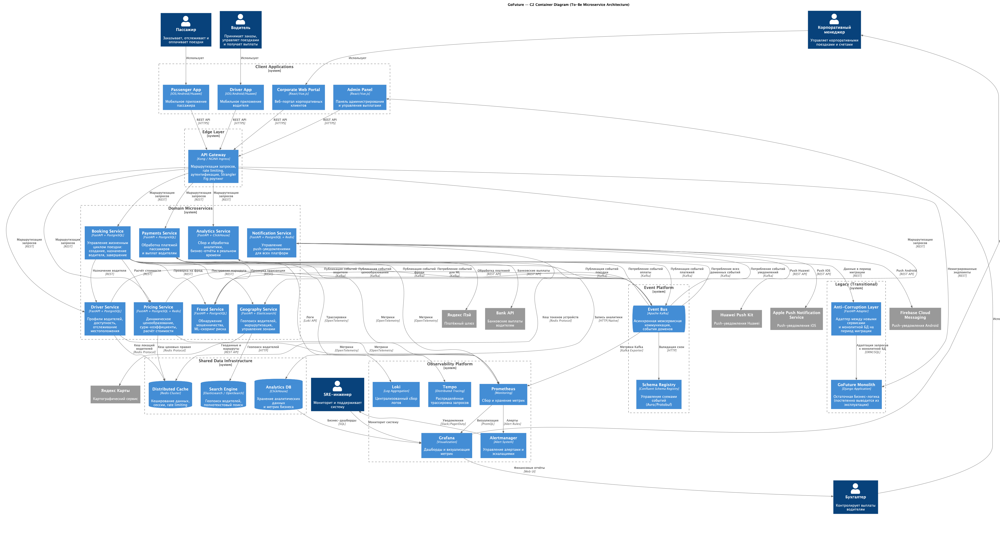

# Задание 1. Проектируем домены — Декомпозиция монолита GoFuture

- **Автор:** GoFuture Architecture Team
- **Дата:** 2026-04-04

## Функциональные требования

Верхнеуровневые Use Cases платформы GoFuture, определяющие доменные границы сервисов.

| **№** | **Действующие лица или системы** | **Use Case**                        | **Описание**                                                                                                                  |
|:-----:|:---------------------------------|:------------------------------------|:------------------------------------------------------------------------------------------------------------------------------|
|   1   | Пассажир                         | Заказ поездки                       | Пассажир создаёт заказ, указывая точки отправления и назначения. Система рассчитывает маршрут, стоимость и подбирает водителя |
|   2   | Пассажир                         | Отслеживание поездки                | Пассажир в реальном времени видит местоположение водителя и статус поездки                                                    |
|   3   | Пассажир                         | Оплата поездки                      | После завершения поездки система списывает оплату через платёжный шлюз                                                        |
|   4   | Пассажир                         | Оценка водителя                     | Пассажир оценивает качество поездки и водителя                                                                                |
|   5   | Водитель                         | Принятие заказа                     | Водитель получает уведомление о заказе и принимает или отклоняет его                                                          |
|   6   | Водитель                         | Навигация по маршруту               | Водитель использует встроенную навигацию для выполнения поездки                                                               |
|   7   | Водитель                         | Получение выплат                    | Водитель получает выплаты за выполненные поездки на банковский счёт                                                           |
|   8   | Водитель                         | Управление доступностью             | Водитель управляет своим статусом (онлайн/офлайн) и зоной работы                                                              |
|   9   | Корпоративный менеджер           | Управление корпоративными поездками | Менеджер создаёт и контролирует корпоративные заказы, управляет лимитами                                                      |
|  10   | Корпоративный менеджер           | Просмотр отчётов                    | Менеджер просматривает аналитику по расходам и поездкам                                                                       |
|  11   | Бухгалтер                        | Контроль выплат                     | Бухгалтер контролирует корректность начислений и выплат водителям                                                             |
|  12   | Бухгалтер                        | Финансовая отчётность               | Бухгалтер формирует финансовые отчёты по платежам и выплатам                                                                  |
|  13   | Система (Pricing)                | Динамическое ценообразование        | Автоматический расчёт стоимости поездки с учётом спроса, предложения и сурж-коэффициентов                                     |
|  14   | Система (Fraud)                  | Обнаружение мошенничества           | ML-модели анализируют транзакции и поведение пользователей для выявления фрода                                                |
|  15   | Система (Geography)              | «Умное» распределение водителей     | Интеллектуальное назначение водителей с учётом загрузки зон для предотвращения «горячих точек»                                |

## Нефункциональные требования

Архитектурно значимые требования, определяющие ключевые характеристики целевой микросервисной архитектуры.

| **№**  | **Категория**           | **Требование**                                                         | **Метрика / целевое значение**                          |
|:------:|:------------------------|:-----------------------------------------------------------------------|:--------------------------------------------------------|
| NFR-1  | Производительность      | Обработка большого количества конкурентных поездок                     | ≥ 500 000 одновременных активных поездок                |
| NFR-2  | Доступность             | Высокая доступность критических сервисов (Booking, Payments, Driver)   | ≥ 99,95% uptime (≤ 26 минут простоя в год)              |
| NFR-3  | Масштабируемость        | Горизонтальное масштабирование в нескольких географических регионах    | ≥ 3 регионов, автоскейлинг по нагрузке                  |
| NFR-4  | Time-to-market          | Сокращение времени выхода новых функций на рынок                       | ≤ 2 недели от разработки до продакшена                  |
| NFR-5  | Отказоустойчивость      | Минимальное время восстановления после инцидентов                      | MTTR ≤ 15 минут (с текущих > 4 часов)                   |
| NFR-6  | Сборка и деплой         | Быстрая сборка и независимый деплой каждого сервиса                    | Время сборки ≤ 5 минут (с текущих > 30 минут)           |
| NFR-7  | Реальное время          | Динамическое ценообразование и трекинг в реальном времени              | Латентность обновления цены ≤ 500 мс                    |
| NFR-8  | Комплаенс               | Соответствие локальным регуляторным требованиям в каждом регионе       | Данные хранятся в регионе присутствия (data residency)  |
| NFR-9  | Интеграция              | Поддержка локальных платёжных и картографических сервисов              | Подключение нового провайдера за ≤ 2 недели             |
| NFR-10 | Наблюдаемость           | Полное покрытие метрик, логов и трейсов для всех сервисов              | 100% покрытие критических сервисов; SLI/SLO для каждого |
| NFR-11 | Безопасность            | Централизованная аутентификация и авторизация                          | OAuth 2.0 / OIDC через Keycloak; JWT-токены             |
| NFR-12 | Согласованность данных  | Обеспечение eventual consistency между сервисами                       | Задержка синхронизации ≤ 5 секунд; Saga для транзакций  |
| NFR-13 | Независимость деплоя    | Каждый сервис деплоится, масштабируется и откатывается независимо      | Нулевое влияние деплоя одного сервиса на другие         |
| NFR-14 | Устойчивость к нагрузке | Система корректно работает при пиковых нагрузках без каскадных отказов | Circuit breaker, bulkhead, rate limiting                |

## Решение

### Карта доменных сервисов

На основании анализа текущего монолита (см. C3-диаграмму) и организационной структуры компании (8 продуктовых команд)
выделены следующие доменные сервисы. Границы сервисов соответствуют командам, что обеспечивает закон Конвея и автономию
разработки.

| **Сервис**           | **Домен**    | **Команда**  | **Ответственность**                                                                             | **Стек**                        |
|:---------------------|:-------------|:-------------|:------------------------------------------------------------------------------------------------|:--------------------------------|
| Booking Service      | Booking      | Booking      | Жизненный цикл поездки: создание заказа, назначение водителя, отслеживание статуса, завершение  | FastAPI + PostgreSQL            |
| Driver Service       | Driver       | Driver       | Профили водителей, управление доступностью, отслеживание GPS-координат, рейтинг                 | FastAPI + PostgreSQL + Redis    |
| Pricing Service      | Pricing      | Pricing      | Динамическое ценообразование, сурж-коэффициенты, расчёт стоимости поездки, правила тарификации  | FastAPI + PostgreSQL + Redis    |
| Payments Service     | Payments     | Payments     | Обработка платежей пассажиров, выплаты водителям, интеграция с платёжными шлюзами и банками     | FastAPI + PostgreSQL            |
| Notification Service | Notification | Notification | Push-уведомления (FCM, APNs, Huawei Push Kit), email, SMS, управление подписками                | FastAPI + PostgreSQL + Redis    |
| Geography Service    | Geography    | Geography    | Геопоиск ближайших водителей, построение маршрутов, управление геозонами, «умное» распределение | FastAPI + Elasticsearch + Redis |
| Analytics Service    | Analytics    | Analytics    | Сбор событий, real-time аналитика, бизнес-отчёты, ML-пайплайны данных                           | FastAPI + ClickHouse + Kafka    |
| Fraud Service        | Fraud        | Fraud        | ML-скоринг риска, обнаружение мошенничества, проверка транзакций и поведения пользователей      | FastAPI + PostgreSQL            |

### Платформенные компоненты

| **Компонент**     | **Технология**                                     | **Назначение**                                                                          |
|:------------------|:---------------------------------------------------|:----------------------------------------------------------------------------------------|
| API Gateway       | Kong / NGINX Ingress                               | Единая точка входа, маршрутизация, rate limiting, аутентификация, Strangler Fig роутинг |
| Event Bus         | Apache Kafka + Schema Registry (Avro/Protobuf)     | Асинхронная межсервисная коммуникация, публикация доменных событий                      |
| Distributed Cache | Redis Cluster                                      | Кеширование данных, хранение сессий, rate limiting                                      |
| Search Engine     | Elasticsearch / OpenSearch                         | Геопоиск водителей, полнотекстовый поиск                                                |
| Analytics DB      | ClickHouse                                         | Хранение и обработка аналитических данных                                               |
| Orchestration     | Kubernetes + Helm                                  | Оркестрация контейнеров, автоскейлинг                                                   |
| CI/CD             | GitHub Actions + Argo CD                           | Непрерывная интеграция и доставка (GitOps)                                              |
| Observability     | Prometheus + Grafana + Loki + Tempo + Alertmanager | Метрики, логи, трейсы, алерты                                                           |

### Диаграмма C2 (To-Be)

Целевая архитектура представлена на C2-диаграмме контейнеров:



Диаграмма в формате PlantUML: [C2_tobe.puml](diagrams/puml/C2_tobe.puml)

**Ключевые архитектурные решения на диаграмме:**

1. **API Gateway (Kong)** — единая точка входа для всех клиентов. Реализует паттерн Strangler Fig: на этапе миграции
   часть запросов маршрутизируется на новые сервисы, часть — на монолит.

2. **Event Bus (Apache Kafka)** — все доменные события публикуются в Kafka-топики. Schema Registry обеспечивает
   контракты между сервисами через Avro/Protobuf-схемы.

3. **Anti-Corruption Layer (ACL)** — адаптер между новыми сервисами и монолитной БД. Используется на переходном этапе
   для доступа к ещё не мигрированным данным.

4. **Database per Service** — каждый сервис имеет собственную базу данных (PostgreSQL), что обеспечивает независимость
   деплоя и масштабирования.

5. **Монолит (Transitional)** — остаточная часть монолита, которая постепенно выводится из эксплуатации по мере
   извлечения сервисов.

### Механизмы обеспечения обратной совместимости

| **Механизм**                | **Описание**                                                                                                                                       | **Где применяется**                             |
|:----------------------------|:---------------------------------------------------------------------------------------------------------------------------------------------------|:------------------------------------------------|
| Strangler Fig Pattern       | API Gateway маршрутизирует запросы на новый сервис или монолит в зависимости от готовности. Переключение через конфигурацию без изменения клиентов | Все сервисы на этапе извлечения                 |
| Anti-Corruption Layer (ACL) | Адаптер, транслирующий запросы из формата нового сервиса в формат монолитной БД. Изолирует новые сервисы от legacy-модели данных                   | Booking, Driver, Payments — на переходном этапе |
| API Versioning              | Контракты API версионируются (v1 = совместим с монолитом, v2 = нативный микросервис). Клиенты мигрируют постепенно                                 | Все публичные API                               |
| Transactional Outbox        | Надёжная публикация событий: сервис записывает событие в outbox-таблицу в той же транзакции, отдельный процесс (Debezium CDC) публикует в Kafka    | Booking, Payments, Driver                       |
| Feature Flags               | Постепенное переключение трафика на новый сервис (canary release). Возможность мгновенного отката на монолит                                       | Все сервисы при Go-Live                         |
| Dual-Write + Reconciliation | На период миграции данные пишутся и в монолитную, и в сервисную БД. Фоновый процесс сверяет согласованность                                        | Payments, Booking (критичные данные)            |
| Contract Testing            | Контрактные тесты (Pact) между сервисами и между сервисом и API Gateway гарантируют совместимость при обновлениях                                  | Все межсервисные взаимодействия                 |

## Очерёдность выделения сервисов

Логика приоритизации основана на трёх критериях:

1. **Связанность** — сервисы с наименьшим количеством зависимостей извлекаются первыми.
2. **Бизнес-ценность** — приоритет сервисам, дающим максимальный эффект масштабирования.
3. **Риск** — критичные финансовые сервисы извлекаются позже, когда команда набирает опыт.

### Фаза 1: Стабилизация и первый сервис (месяцы 1–2)

**Notification Service** — первый кандидат на извлечение.

| Критерий         | Обоснование                                                                                                                                |
|:-----------------|:-------------------------------------------------------------------------------------------------------------------------------------------|
| Связанность      | Минимальная: не хранит бизнес-состояние, только доставляет уведомления. Единственная зависимость — получение событий из очереди            |
| Бизнес-ценность  | Снимает нагрузку push-уведомлений с монолита. Позволяет независимо масштабировать при пиковых нагрузках (массовые рассылки)                |
| Риск             | Минимальный: отказ уведомлений не блокирует бизнес-процесс поездки                                                                         |
| Паттерн миграции | Strangler Fig: API Gateway перенаправляет /notifications/* на новый сервис. Монолит публикует события в Kafka вместо прямых вызовов Celery |

**Параллельно:** развёртывание платформенной инфраструктуры (Kafka, API Gateway, Kubernetes, CI/CD, Observability).

### Фаза 2: Высокоценные извлечения (месяцы 3–4)

**Geography Service** и **Pricing Service** извлекаются параллельно (разные команды).

| Сервис            | Связанность                                                                                                 | Бизнес-ценность                                                                                                         | Риск                                                                     |
|:------------------|:------------------------------------------------------------------------------------------------------------|:------------------------------------------------------------------------------------------------------------------------|:-------------------------------------------------------------------------|
| Geography Service | Изолированная внешняя зависимость (Яндекс Карты). Собственное хранилище (Elasticsearch). Чёткая API-граница | Критичен для масштабирования геопоиска. Реализация «умного» распределения водителей возможна только в отдельном сервисе | Средний: необходимо обеспечить низкую латентность геозапросов            |
| Pricing Service   | Преимущественно stateless-вычисления. Данные — правила тарификации в Redis/PostgreSQL                       | Динамическое ценообразование — ключевое конкурентное преимущество. Независимое масштабирование при сурже                | Низкий: stateless-природа упрощает миграцию. Минимальная миграция данных |

### Фаза 3: Основные бизнес-домены (месяцы 5–7)

**Driver Service** и **Fraud Service**.

| Сервис         | Связанность                                                                                                 | Бизнес-ценность                                                                                               | Риск                                                                              |
|:---------------|:------------------------------------------------------------------------------------------------------------|:--------------------------------------------------------------------------------------------------------------|:----------------------------------------------------------------------------------|
| Driver Service | Средняя: используется Booking, Payments (выплаты), Geography. К этому моменту Geography уже извлечён        | Критичен для обработки 500K поездок: хранение и обновление GPS-координат — одна из самых нагруженных операций | Средний: необходима миграция данных профилей водителей и их координат             |
| Fraud Service  | Низкая: потребляет данные из других доменов (read-only), записывает только в свою БД. ML-модели изолированы | Защита от мошенничества — обязательное требование при масштабировании на новые рынки                          | Низкий: read-heavy, собственная БД, ML-пайплайн отделён от транзакционных потоков |

### Фаза 4: Платёжный домен (месяцы 8–10)

**Payments Service** — извлекается позже из-за высоких требований к согласованности финансовых данных.

| Критерий         | Обоснование                                                                                                                                                                                                    |
|:-----------------|:---------------------------------------------------------------------------------------------------------------------------------------------------------------------------------------------------------------|
| Связанность      | Высокая: интеграция с Яндекс Пэй, банковскими API, взаимодействие с Booking (списание) и Driver (выплаты)                                                                                                      |
| Бизнес-ценность  | Ключевой финансовый сервис. Независимый деплой позволяет быстрее подключать локальные платёжные системы в новых регионах                                                                                       |
| Риск             | Высокий: финансовые данные требуют строгой согласованности, аудита, соответствия регуляторным требованиям                                                                                                      |
| Паттерн миграции | Saga (choreography-based) для распределённых транзакций. Dual-write с reconciliation. Outbox pattern для надёжной публикации событий. Параллельная работа старого и нового сервиса с постепенным переключением |

### Фаза 5: Ядро и аналитика (месяцы 11–12)

**Analytics Service** и **Booking Service**.

| Сервис            | Связанность                                                                                                                                            | Бизнес-ценность                                                                     | Риск                                                                                                                                   |
|:------------------|:-------------------------------------------------------------------------------------------------------------------------------------------------------|:------------------------------------------------------------------------------------|:---------------------------------------------------------------------------------------------------------------------------------------|
| Analytics Service | Низкая: по природе event-driven, потребляет события из Kafka. К этому моменту все домены публикуют события                                             | Бизнес-аналитика в реальном времени. ML-прогнозирование спроса                      | Низкий: read-heavy, данные пишутся в ClickHouse. Нет обратных зависимостей                                                             |
| Booking Service   | Максимальная: оркестрирует Driver, Pricing, Payments, Geography, Fraud, Notification. Извлекается последним, когда все зависимости уже стали сервисами | Ядро бизнес-логики. Независимое масштабирование позволяет обрабатывать 500K поездок | Высокий: самый большой объём данных, множество зависимостей. Но к этому моменту все зависимости уже мигрированы, что снижает сложность |

### Сводная таблица очерёдности

| Фаза | Месяцы | Сервис               | Приоритет | Паттерн миграции             |
|:-----|:-------|:---------------------|:----------|:-----------------------------|
| 1    | 1–2    | Notification Service | Первый    | Strangler Fig + Kafka events |
| 2    | 3–4    | Geography Service    | Высокий   | Strangler Fig + ACL          |
| 2    | 3–4    | Pricing Service      | Высокий   | Strangler Fig                |
| 3    | 5–7    | Driver Service       | Средний   | Strangler Fig + CDC + ACL    |
| 3    | 5–7    | Fraud Service        | Средний   | Strangler Fig + Kafka events |
| 4    | 8–10   | Payments Service     | Критичный | Saga + Dual-write + Outbox   |
| 5    | 11–12  | Analytics Service    | Высокий   | Kafka consumer migration     |
| 5    | 11–12  | Booking Service      | Критичный | Strangler Fig + Saga + ACL   |

## План миграции данных

### Общая стратегия миграции

Для каждого извлекаемого сервиса применяется следующий пошаговый процесс:

```
┌──────────────┐    ┌──────────────┐    ┌──────────────┐    ┌──────────────┐    ┌──────────────┐
│  1. Создание │───▶│  2. CDC      │───▶│  3. Dual-    │───▶│  4. Switch   │───▶│  5. Cleanup  │
│  схемы       │    │  репликация  │    │  Write       │    │  Reads       │    │  монолита    │
│  сервиса     │    │  (Debezium)  │    │  + Reconcile │    │  + Stop      │    │              │
│              │    │              │    │              │    │  Write to    │    │              │
│              │    │              │    │              │    │  monolith    │    │              │
└──────────────┘    └──────────────┘    └──────────────┘    └──────────────┘    └──────────────┘
```

**Шаг 1. Создание схемы сервиса:**

- Создаётся PostgreSQL-инстанс для нового сервиса.
- Alembic-миграции формируют целевую схему данных.
- Схема проектируется исходя из потребностей домена (не копия монолита).

**Шаг 2. CDC-репликация (Debezium):**

- Debezium CDC настраивается на таблицы монолита, относящиеся к домену.
- Данные реплицируются в новую БД сервиса в реальном времени.
- Трансформация данных из legacy-модели в доменную модель сервиса.

**Шаг 3. Dual-Write + Reconciliation:**

- Новый сервис начинает принимать запросы на запись.
- Параллельно данные записываются и в монолитную БД (через ACL).
- Фоновый reconciliation-процесс сверяет данные между двумя БД.

**Шаг 4. Переключение чтений и остановка записи в монолит:**

- Все операции чтения переключаются на БД нового сервиса.
- Запись в монолитную БД для мигрированных таблиц прекращается.
- ACL переключается в режим «только чтение» или отключается.

**Шаг 5. Cleanup монолита:**

- Мигрированные таблицы архивируются и удаляются из монолитной БД.
- Соответствующий код удаляется из монолита.
- Django-миграции фиксируют удаление таблиц.

### Детальный план по сервисам

> Note: названия таблиц и объемы данных примерные, какие могли бы быть в реальной системе.

#### Notification Service (Фаза 1)

| Параметр            | Значение                                                                                               |
|:--------------------|:-------------------------------------------------------------------------------------------------------|
| Мигрируемые таблицы | `notifications`, `device_tokens`, `notification_templates`                                             |
| Объём данных        | Небольшой (< 10 ГБ): токены устройств и шаблоны                                                        |
| Стратегия           | Простой экспорт/импорт. Нет необходимости в CDC — данные не критичны для бизнес-транзакций             |
| Время простоя       | 0 — токены устройств кешируются в Redis, при переключении пользователи переподписываются автоматически |
| Откат               | Переключение роутинга в API Gateway обратно на монолит                                                 |

#### Geography Service (Фаза 2)

| Параметр           | Значение                                                                                                                                                            |
|:-------------------|:--------------------------------------------------------------------------------------------------------------------------------------------------------------------|
| Мигрируемые данные | Elasticsearch-индексы (координаты водителей, геозоны), таблицы `zones`, `routes` в PostgreSQL                                                                       |
| Объём данных       | Elasticsearch: ~50 ГБ индексов. PostgreSQL: < 1 ГБ справочников                                                                                                     |
| Стратегия          | Создание новых Elasticsearch-индексов с правильным маппингом. Параллельная индексация. Переключение alias на новые индексы. PostgreSQL — простой pg_dump/pg_restore |
| Время простоя      | 0 — Elasticsearch alias переключается атомарно                                                                                                                      |
| Откат              | Переключение Elasticsearch alias обратно на старые индексы                                                                                                          |

#### Pricing Service (Фаза 2)

| Параметр            | Значение                                                                                                      |
|:--------------------|:--------------------------------------------------------------------------------------------------------------|
| Мигрируемые таблицы | `pricing_rules`, `surge_configs`, `tariff_zones`                                                              |
| Объём данных        | < 100 МБ — правила тарификации и конфигурации                                                                 |
| Стратегия           | pg_dump/pg_restore + синхронизация Redis-кеша. Pricing stateless — основные данные это правила и конфигурации |
| Время простоя       | 0 — при переключении кеш Redis прогревается заранее                                                           |
| Откат               | Переключение роутинга в API Gateway                                                                           |

#### Driver Service (Фаза 3)

| Параметр            | Значение                                                                                                                                         |
|:--------------------|:-------------------------------------------------------------------------------------------------------------------------------------------------|
| Мигрируемые таблицы | `drivers`, `driver_profiles`, `driver_documents`, `driver_ratings`, `driver_locations`                                                           |
| Объём данных        | ~100 ГБ (в основном историческая геолокация). Профили: ~5 ГБ                                                                                     |
| Стратегия           | CDC (Debezium) для непрерывной репликации. Историческая геолокация мигрируется batch-процессом. Текущая геолокация — через Redis (write-through) |
| Время простоя       | 0 — CDC обеспечивает непрерывную синхронизацию                                                                                                   |
| Откат               | Переключение на чтение из монолитной БД + остановка записи в новую БД                                                                            |

#### Fraud Service (Фаза 3)

| Параметр            | Значение                                                                                                                    |
|:--------------------|:----------------------------------------------------------------------------------------------------------------------------|
| Мигрируемые таблицы | `fraud_rules`, `fraud_scores`, `fraud_incidents`, `risk_profiles`                                                           |
| Объём данных        | ~20 ГБ (в основном исторические скоринги)                                                                                   |
| Стратегия           | Экспорт/импорт правил (< 100 МБ). ML-модели хранятся в S3/MLflow — отдельная миграция. Исторические данные — batch-миграция |
| Время простоя       | 0 — Fraud Service начинает накапливать собственные данные параллельно с монолитом                                           |
| Откат               | Переключение роутинга. ML-модели версионируются и откатываются независимо                                                   |

#### Payments Service (Фаза 4)

| Параметр            | Значение                                                                                                                                                                                                                                                                |
|:--------------------|:------------------------------------------------------------------------------------------------------------------------------------------------------------------------------------------------------------------------------------------------------------------------|
| Мигрируемые таблицы | `payments`, `payment_methods`, `payouts`, `payout_schedules`, `transactions`, `refunds`                                                                                                                                                                                 |
| Объём данных        | ~500 ГБ (финансовые транзакции за всё время)                                                                                                                                                                                                                            |
| Стратегия           | **Самая сложная миграция.** CDC (Debezium) + Dual-Write + Reconciliation. Миграция по временным диапазонам: сначала исторические данные (batch), затем активные транзакции (CDC). Обязательный финансовый аудит до и после. Reconciliation-джобы с точностью до копейки |
| Время простоя       | 0 — Dual-Write обеспечивает непрерывность. Период dual-write: 2–4 недели                                                                                                                                                                                                |
| Откат               | Полный откат на монолит в течение 1 часа. Dual-Write позволяет мгновенно переключить трафик                                                                                                                                                                             |

#### Analytics Service (Фаза 5)

| Параметр           | Значение                                                                                                                                                                                              |
|:-------------------|:------------------------------------------------------------------------------------------------------------------------------------------------------------------------------------------------------|
| Мигрируемые данные | ClickHouse-таблицы аналитики, ETL-конфигурации, дашборды Grafana/DataLens                                                                                                                             |
| Объём данных       | ~2 ТБ в ClickHouse                                                                                                                                                                                    |
| Стратегия          | ClickHouse данные остаются на месте — меняется только источник событий (с AMQP/Celery на Kafka). Новые Kafka-consumers начинают писать параллельно. После верификации старые ETL-процессы отключаются |
| Время простоя      | 0 — параллельная запись из двух источников                                                                                                                                                            |
| Откат              | Возврат к старым ETL-процессам                                                                                                                                                                        |

#### Booking Service (Фаза 5)

| Параметр            | Значение                                                                                                                                                                                                                                                                                                                              |
|:--------------------|:--------------------------------------------------------------------------------------------------------------------------------------------------------------------------------------------------------------------------------------------------------------------------------------------------------------------------------------|
| Мигрируемые таблицы | `bookings`, `rides`, `ride_statuses`, `ride_events`, `booking_history`                                                                                                                                                                                                                                                                |
| Объём данных        | ~1 ТБ (самая большая таблица в монолите)                                                                                                                                                                                                                                                                                              |
| Стратегия           | Миграция по временным диапазонам. CDC (Debezium) для активных поездок. Batch-миграция для исторических данных (по месяцам). К этому моменту все зависимые сервисы уже мигрированы — Booking переключается на вызовы микросервисов через REST/Kafka. Saga-паттерн для распределённых транзакций (booking → pricing → driver → payment) |
| Время простоя       | 0 — CDC + Dual-Write. Период dual-write: 4–6 недель (наибольший среди всех сервисов)                                                                                                                                                                                                                                                  |
| Откат               | Полный откат через API Gateway (Strangler Fig). Dual-Write обеспечивает целостность данных в обеих БД                                                                                                                                                                                                                                 |

### Сводная таблица миграции данных

| Сервис       | Объём данных | Стратегия                | CDC | Dual-Write | Время Dual-Write |
|:-------------|:-------------|:-------------------------|:----|:-----------|:-----------------|
| Notification | < 10 ГБ      | Export/Import            | Нет | Нет        | —                |
| Geography    | ~50 ГБ       | ES Alias + pg_dump       | Нет | Нет        | —                |
| Pricing      | < 100 МБ     | pg_dump + Redis sync     | Нет | Нет        | —                |
| Driver       | ~100 ГБ      | CDC + Batch              | Да  | Да         | 2 недели         |
| Fraud        | ~20 ГБ       | Export + Batch           | Нет | Нет        | —                |
| Payments     | ~500 ГБ      | CDC + Dual-Write         | Да  | Да         | 2–4 недели       |
| Analytics    | ~2 ТБ        | Parallel consumers       | Нет | Нет        | —                |
| Booking      | ~1 ТБ        | CDC + Batch + Dual-Write | Да  | Да         | 4–6 недель       |

## Альтернативы

### 1. Big Bang Rewrite (полная переписка)

Полная переписка монолита на микросервисы с нуля вместо постепенного извлечения.

**Преимущества:** чистая архитектура без legacy-компромиссов.
**Недостатки:** высокий риск, длительный срок (12–18 месяцев без продакшен-релизов), невозможность параллельной
разработки новых бизнес-фич. Не подходит для компании, активно расширяющейся на новые рынки.

### 2. Модульный монолит как промежуточный шаг

Сначала выделить чёткие модульные границы внутри монолита (Django apps), а затем извлекать сервисы.

**Преимущества:** меньший риск на первом этапе, быстрый старт.
**Недостатки:** не решает проблему масштабирования (единая БД, единый деплой). Задерживает получение ключевых выгод
микросервисов. Может стать «ловушкой» — модульный монолит окажется «достаточно хорошим» и миграция остановится.

### 3. Извлечение Booking Service первым (вместо Notification)

Начать с самого бизнес-критичного сервиса для максимальной отдачи.

**Преимущества:** быстрый бизнес-эффект.
**Недостатки:** Booking имеет наибольшее количество зависимостей. Извлечение без готовой инфраструктуры (Kafka, Gateway)
и без опыта команды приведёт к провалу.

**Недостатки, ограничения, риски**

| **Риск**                            | **Влияние**                                                      | **Митигация**                                                                              |
|:------------------------------------|:-----------------------------------------------------------------|:-------------------------------------------------------------------------------------------|
| Сложность распределённых транзакций | Потеря строгой согласованности (ACID → eventual consistency)     | Saga-паттерн, idempotent consumers, reconciliation-джобы                                   |
| Увеличение операционной сложности   | 8 сервисов вместо 1 монолита: больше точек отказа, сложнее дебаг | Observability stack (Prometheus + Grafana + Loki + Tempo), стандартизация через Helm-чарты |
| Организационное сопротивление       | Команды привыкли к монолитной разработке                         | Обучение, постепенный переход, DevOps-культура, платформенная команда                      |
| Data consistency во время миграции  | Рассинхронизация данных между монолитом и новыми сервисами       | CDC + Dual-Write + Reconciliation-джобы с алертами                                         |
| Latency overhead                    | Межсервисные вызовы вместо in-process                            | Кеширование (Redis), async communication (Kafka), оптимизация критического пути            |
| Vendor lock-in на Kafka             | Зависимость от Kafka как центральной шины                        | Абстракция через интерфейсы, стандартные протоколы (CloudEvents)                           |
| Нехватка экспертизы Kubernetes      | Команда привыкла к Docker Compose                                | Обучение, поддержка SRE-команды, managed Kubernetes                                        |
