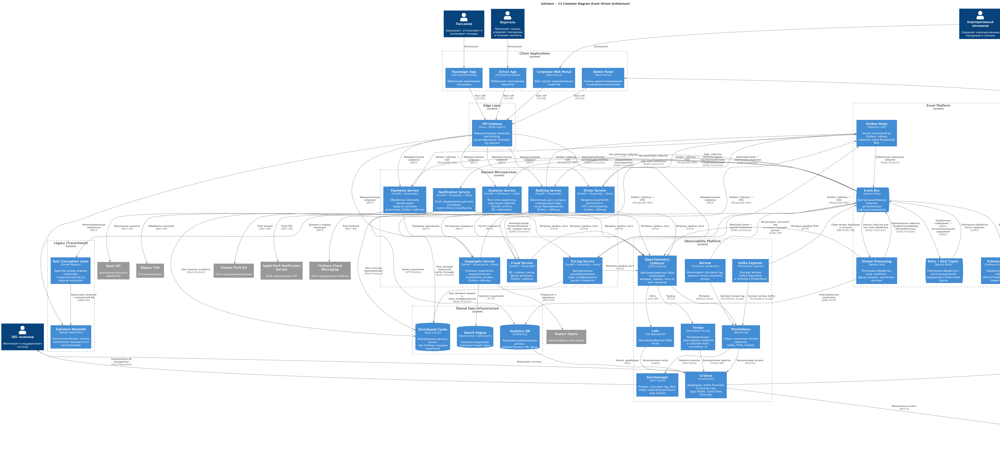

# Задание 2. Проектируем Event-Driven архитектуру

## Контекст

В [Задании 1](../../task1/results/README.md) была выполнена декомпозиция монолита GoFuture на 8 доменных
микросервисов (Booking, Driver, Pricing, Payments, Notification, Geography, Analytics, Fraud) с C2-диаграммой
To-Be архитектуры. Kafka и Schema Registry уже были определены как основа асинхронной коммуникации.

Задание 2 развивает событийную платформу в полноценную Event-Driven архитектуру: определяет модель доменных
событий, схему Kafka-топиков с региональным партиционированием, Choreography-based Saga для бронирования,
механизмы надёжной доставки и подход к мониторингу.

## Требования

- Модель доменных событий (BookingCreated, DriverLocationUpdated и др.)
- Схема топиков Kafka с партиционированием по регионам
- Потоковая обработка (Apache Flink) для real-time обработки событий
- Выбор вида Saga и проработка событий
- Механизмы обеспечения надёжной доставки
- Подход к мониторингу и список метрик
- Инструменты мониторинга, интегрированные в архитектуру To-Be

## Решение — обзор

| Компонент            | Выбранное решение                                                                                    |
|----------------------|------------------------------------------------------------------------------------------------------|
| Брокер событий       | Apache Kafka с региональным партиционированием                                                       |
| Управление схемами   | Confluent Schema Registry (Avro/Protobuf)                                                            |
| Потоковая обработка  | Apache Flink (5 джобов: surge pricing, fraud scoring, analytics, driver matching, hotspot detection) |
| Saga                 | Choreography-based Saga для процесса бронирования                                                    |
| Надёжная публикация  | Transactional Outbox + Debezium CDC                                                                  |
| Надёжное потребление | Idempotent consumers + Retry Topics + DLQ                                                            |
| Мониторинг           | Prometheus + Kafka Exporter + Burrow + OpenTelemetry + Grafana + Loki + Tempo                        |

## Артефакты

| Артефакт                    | Файл                                                                         | Описание                                                         |
|-----------------------------|------------------------------------------------------------------------------|------------------------------------------------------------------|
| Каталог доменных событий    | [domain-events.md](domain-events.md)                                         | 41 событие по 8 сервисам, формат конверта, версионирование схем  |
| Схема топиков Kafka         | [kafka-topics.md](kafka-topics.md)                                           | 12 доменных топиков, retry/DLQ, consumer groups, Flink-джобы     |
| Реестр Saga-транзакций      | [saga-transactions.md](saga-transactions.md)                                 | Choreography Booking Saga: 13 транзакций, 5 потоков, компенсации |
| Механизмы надёжной доставки | [reliable-delivery.md](reliable-delivery.md)                                 | Outbox, idempotency, retry, DLQ, Schema Registry                 |
| Подход к мониторингу        | [monitoring.md](monitoring.md)                                               | 8 инструментов, 40+ метрик, SLI/SLO, алерты, дашборды            |
| C2-диаграмма Event-Driven   | [diagrams/puml/C2_event_platform.puml](diagrams/puml/C2_event_platform.puml) | PlantUML C4 Container Diagram                                    |

## Диаграмма C2 — Event-Driven архитектура

Диаграмма в формате `.puml`: [C2_event_platform.puml](diagrams/puml/C2_event_platform.puml)

### Ключевые отличия от C2 Task 1

| Элемент                   | Task 1 (базовая)                               | Task 2 (Event-Driven)                                   |
|---------------------------|------------------------------------------------|---------------------------------------------------------|
| Event Platform            | Kafka + Schema Registry                        | + Debezium Outbox Relay, Apache Flink, Retry/DLQ Topics |
| Observability             | Prometheus, Grafana, Loki, Tempo, Alertmanager | + Kafka Exporter, Burrow, OpenTelemetry Collector       |
| Межсервисная коммуникация | REST + Kafka (общие)                           | Детализированные Saga-потоки через Kafka                |
| Публикация событий        | Прямая публикация                              | Outbox → Debezium CDC → Kafka                           |
| Потоковая обработка       | Не детализирована                              | 5 Flink-джобов с конкретными входами/выходами           |

## Альтернативы

### Saga: Orchestration vs Choreography

| Критерий        | Choreography (выбрано)           | Orchestration                         |
|-----------------|----------------------------------|---------------------------------------|
| Связанность     | Слабая — сервисы независимы      | Сильная — оркестратор знает обо всех  |
| SPOF            | Отсутствует                      | Оркестратор — единая точка отказа     |
| Масштабирование | Каждый сервис независимо         | Оркестратор — узкое горлышко          |
| Отладка         | Сложнее (correlation_id + Tempo) | Проще (логика в одном месте)          |
| **Вывод**       | Подходит для 8 автономных команд | Подходит для сложных бизнес-процессов |

### Брокер: Kafka vs RabbitMQ

| Критерий                       | Kafka (выбрано)                            | RabbitMQ (текущий в монолите)          |
|--------------------------------|--------------------------------------------|----------------------------------------|
| Throughput                     | Миллионы msg/sec                           | Десятки тысяч msg/sec                  |
| Региональное партиционирование | Нативная поддержка                         | Отсутствует                            |
| Stream Processing              | Kafka Streams, Flink — нативная интеграция | Нет потоковой обработки                |
| Event Replay                   | Поддерживается (retention-based)           | Сообщения удаляются после ACK          |
| **Вывод**                      | Подходит для 500K+ конкурентных поездок    | Не масштабируется для целевой нагрузки |

### Потоковая обработка: Flink vs Faust

| Критерий        | Apache Flink (выбрано)                              | Faust (Python)                  |
|-----------------|-----------------------------------------------------|---------------------------------|
| Зрелость        | Production-grade, широко используется               | Заброшен, спорная стабильность  |
| Exactly-once    | Нативная поддержка (checkpointing)                  | Best-effort                     |
| Масштабирование | Кластерное, тысячи задач                            | Ограниченное                    |
| **Вывод**       | Инфраструктурный слой, не зависит от языка сервисов | Не рекомендуется для production |

## Компромиссы

| Компромисс                              | Преимущество                               | Ограничение                                                      |
|-----------------------------------------|--------------------------------------------|------------------------------------------------------------------|
| Choreography Saga                       | Децентрализация, нет SPOF                  | Сложнее отслеживать поток (требует correlation_id + трассировку) |
| Transactional Outbox + Debezium         | Атомарная публикация без 2PC               | Дополнительная latency (~100–500ms CDC)                          |
| Региональное партиционирование          | Подготовка к multi-region (Task 3)         | Усложнение ключей и consumer groups                              |
| Apache Flink                            | Exactly-once, высокий throughput           | Дополнительная инфраструктура (отдельный кластер)                |
| 8 инструментов мониторинга              | Полное покрытие всех уровней               | Операционная сложность поддержки стека                           |
| Idempotent consumers (processed_events) | Exactly-once обработка на стороне consumer | Overhead на каждое событие (~1ms проверка)                       |
| DLQ + ручной replay                     | Изоляция «ядовитых» сообщений              | Требует ручного разбора SRE/разработчиками                       |
