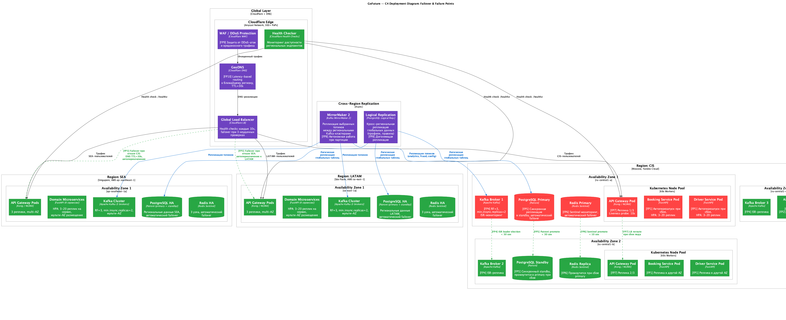
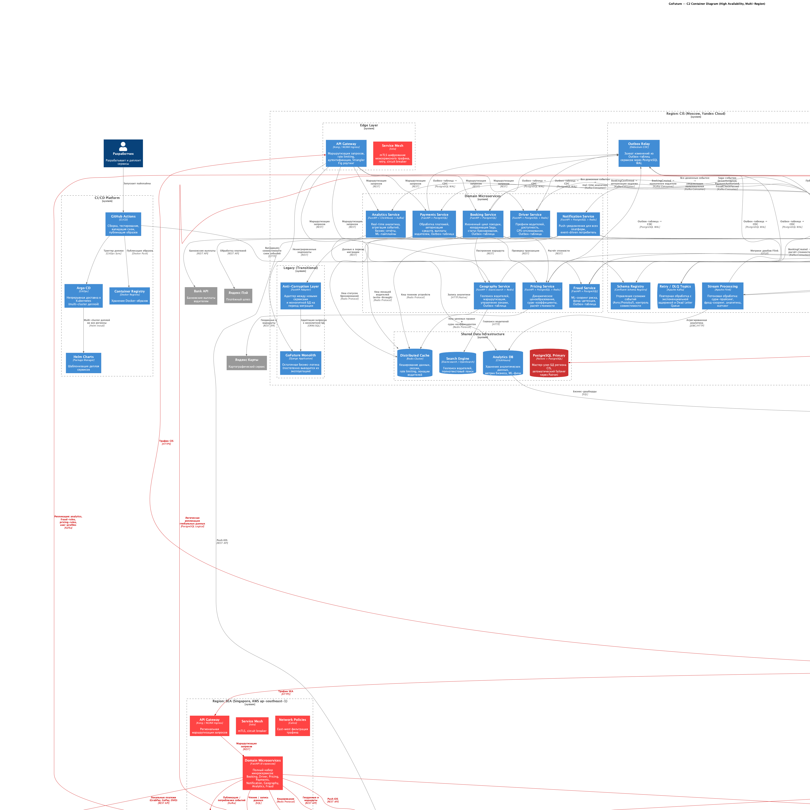

# Задание 3. Обеспечиваем высокую нагрузку и отказоустойчивость

## Контекст

В рамках [Задания 1](../../task1/results/README.md) была выполнена декомпозиция монолита GoFuture на 8 доменных
микросервисов. В [Задании 2](../../task2/results/README.md) спроектирована событийная архитектура на базе Apache Kafka с
паттернами Choreography Saga, Transactional Outbox и полным стеком observability.

Теперь GoFuture выходит на рынки **Юго-Восточной Азии** и **Южной Америки**. Для обеспечения **99,99% доступности** и
**низкой задержки** (<100 мс) необходимо глобальное развёртывание в 3+ географических регионах с полной
отказоустойчивостью.

### Ключевые требования

| # | Требование                            | Метрика                                          |
|---|---------------------------------------|--------------------------------------------------|
| 1 | Глобальная доступность                | 99,99% (≤ 52,6 мин простоя в год)                |
| 2 | Конкурентные поездки                  | 500 000+                                         |
| 3 | Задержка API                          | p99 < 200 мс в каждом регионе                    |
| 4 | Развёртывание                         | 3+ географических региона                        |
| 5 | Failover RTO                          | < 2 мин при отказе региона                       |
| 6 | Failover RPO                          | < 5 сек (асинхронная межрегиональная репликация) |
| 7 | Соответствие регуляторным требованиям | 152-ФЗ (РФ), LGPD (Бразилия), PDPA (Сингапур)    |

---

## Решение — обзор

| Компонент          | Решение                                                      | Обоснование                                         |
|--------------------|--------------------------------------------------------------|-----------------------------------------------------|
| Облачная стратегия | Multi-cloud: Yandex Cloud (CIS) + AWS (SEA, LATAM)           | У Yandex Cloud нет международного присутствия       |
| Регионы            | Москва, Сингапур, Сан-Паулу                                  | Покрытие всех целевых рынков, 3+ AZ в каждом        |
| Edge-слой          | Cloudflare (WAF + DNS + CDN + DDoS)                          | Единый вендор для глобальной защиты и маршрутизации |
| GeoDNS             | Cloudflare DNS с latency-based routing                       | Маршрутизация к ближайшему региону                  |
| БД HA              | Patroni внутри региона + logical replication между регионами | Локальные записи, eventual consistency глобально    |
| Kafka              | Региональные кластеры + MirrorMaker 2                        | Селективная репликация между регионами              |
| Безопасность       | Cloudflare WAF, Istio mTLS, Calico Network Policies          | Эшелонированная защита (defense in depth)           |
| Мониторинг         | Prometheus + Thanos для глобальной агрегации                 | Единая картина метрик по всем регионам              |

---

## 1. Обоснование выбора регионов развёртывания

### 1.1 Выбранные регионы

| Код     | Регион             | Облако       | Город     | AZ                      |
|---------|--------------------|--------------|-----------|-------------------------|
| `cis`   | СНГ                | Yandex Cloud | Москва    | 3 (ru-central1-a/b/d)   |
| `sea`   | Юго-Восточная Азия | AWS          | Сингапур  | 3 (ap-southeast-1a/b/c) |
| `latam` | Южная Америка      | AWS          | Сан-Паулу | 3 (sa-east-1a/b/c)      |

> Коды регионов `cis`, `sea`, `latam` уже используются в
> [Kafka-топиках (Задание 2)](../../task2/results/kafka-topics.md) как часть составного ключа партиционирования
> `{region}:{aggregate_id}`.

### 1.2 Критерии выбора и обоснование

#### Регион CIS — Москва, Yandex Cloud

| Критерий                     | Оценка                                                          |
|------------------------------|-----------------------------------------------------------------|
| **Близость к пользователям** | Основная пользовательская база GoFuture (CIS). Задержка < 20 мс |
| **Регуляторные требования**  | 152-ФЗ требует хранения ПДн граждан РФ на территории России     |
| **Инфраструктура**           | Существующее развёртывание, зрелая инфраструктура Yandex Cloud  |
| **Экономика**                | Наименьшие затраты на миграцию — инфраструктура уже существует  |

#### Регион SEA — Сингапур, AWS ap-southeast-1

| Критерий                     | Оценка                                                                                          |
|------------------------------|-------------------------------------------------------------------------------------------------|
| **Близость к пользователям** | Сингапур — сетевой хаб ЮВА. Задержка до Джакарты ~15 мс, Бангкока ~30 мс, Ханоя ~40 мс          |
| **Регуляторные требования**  | PDPA (Сингапур) — умеренные требования к защите данных                                          |
| **Инфраструктура**           | AWS ap-southeast-1 — самый зрелый регион AWS в ЮВА с 3 AZ                                       |
| **Рынок**                    | Индонезия (270M), Вьетнам (97M), Таиланд (70M), Филиппины (110M) — суммарно 550M+ пользователей |

#### Регион LATAM — Сан-Паулу, AWS sa-east-1

| Критерий                     | Оценка                                                                        |
|------------------------------|-------------------------------------------------------------------------------|
| **Близость к пользователям** | Задержка до Буэнос-Айреса ~25 мс, Боготы ~60 мс, Лимы ~50 мс                  |
| **Регуляторные требования**  | LGPD (Бразилия) — требования к согласию, портируемости данных, назначению DPO |
| **Инфраструктура**           | AWS sa-east-1 — единственный полноценный регион AWS в Южной Америке с 3 AZ    |
| **Рынок**                    | Бразилия (210M) — крупнейший рынок ЮА, колоссальный спрос на такси-сервисы    |

### 1.3 Обоснование multi-cloud стратегии

Yandex Cloud не имеет дата-центров за пределами России, поэтому для международной экспансии необходим второй облачный
провайдер. Выбор AWS обусловлен:

- **Глобальное покрытие** — 30+ регионов, включая Сингапур и Сан-Паулу
- **Зрелость сервисов** — managed Kubernetes (EKS), RDS PostgreSQL, ElastiCache, MSK (Managed Kafka)
- **Совместимость со стеком** — все компоненты стека (PostgreSQL, Kafka, Redis, Elasticsearch) доступны как managed
  services

Для абстрагирования от облачного провайдера используется Kubernetes как единый слой оркестрации: Yandex Managed K8s
в CIS и Amazon EKS в SEA/LATAM. Helm-чарты и Argo CD обеспечивают единообразный деплой во все регионы.

### 1.4 Перспектива расширения

При дальнейшем росте трафика в ЮВА возможно добавление **4-го региона в Джакарте** (AWS ap-southeast-3), что
обусловлено:

- Индонезия — крупнейший рынок ЮВА (270M населения)
- Закон GR 71/2019 требует локализации определённых категорий данных
- Снижение задержки для индонезийских пользователей с ~15 мс (из Сингапура) до < 5 мс

---

## 2. Схема репликации данных между регионами

### 2.1 Классификация данных по области репликации

| Категория                   | Данные                                                                            | Репликация                             | Обоснование                                                                          |
|-----------------------------|-----------------------------------------------------------------------------------|----------------------------------------|--------------------------------------------------------------------------------------|
| **Регион-локальные**        | Активные бронирования, GPS-локации водителей, текущие поездки, сессии             | Нет кросс-региональной                 | Поездка физически происходит в одном городе, данные нужны только локально            |
| **Глобально реплицируемые** | Профили пользователей, платёжные методы, фрод-правила, ML-модели, ценовые правила | Асинхронная репликация                 | Пользователь может путешествовать между регионами; правила единые для всей платформы |
| **Конфигурационные**        | Feature flags, зональные коэффициенты, настройки уведомлений                      | Репликация через Kafka-топики          | Конфигурация меняется редко, eventual consistency приемлема                          |
| **Аналитические**           | Метрики бизнеса, агрегированная статистика                                        | ETL-агрегация в центральный ClickHouse | Для глобальных дашбордов и отчётов                                                   |

### 2.2 Репликация по слоям данных

#### PostgreSQL

```
┌────────────────────────────────────────────────────────────────┐
│                    Топология PostgreSQL                        │
├────────────────────────────────────────────────────────────────┤
│                                                                │
│  CIS (Moscow)          SEA (Singapore)      LATAM (São Paulo)  │
│  ┌──────────┐          ┌──────────┐         ┌──────────┐       │
│  │ Primary  │◄────────►│ Primary  │◄───────►│ Primary  │       │
│  │ (Patroni)│  Logical │ (Patroni)│ Logical │ (Patroni)│       │
│  └────┬─────┘  Repl.   └────┬─────┘  Repl.  └────┬─────┘       │
│       │                     │                     │            │
│  ┌────▼─────┐          ┌────▼─────┐         ┌────▼─────┐       │
│  │ Standby  │          │ Standby  │         │ Standby  │       │
│  │ (sync)   │          │ (sync)   │         │ (sync)   │       │
│  └──────────┘          └──────────┘         └──────────┘       │
│                                                                │
│  Внутри региона: синхронная streaming replication (Patroni)    │
│  Между регионами: асинхронная logical replication              │
│  (только глобальные таблицы: users, payment_methods,           │
│   fraud_rules, pricing_rules)                                  │
└────────────────────────────────────────────────────────────────┘
```

| Параметр              | Значение                                                                      |
|-----------------------|-------------------------------------------------------------------------------|
| Внутри региона        | Patroni + синхронная streaming replication                                    |
| Между регионами       | PostgreSQL logical replication (асинхронная)                                  |
| Реплицируемые таблицы | `users`, `payment_methods`, `fraud_rules`, `pricing_rules`, `driver_profiles` |
| RPO (кросс-регион)    | < 5 сек (типичный lag логической репликации)                                  |
| RTO (внутри региона)  | < 30 сек (Patroni автоматический failover)                                    |
| Конфликт записей      | Невозможен — каждый регион владеет своими записями (partition by `region`)    |

**Стратегия владения данными**: каждая строка в таблице содержит поле `region`, и запись выполняется только в «своём»
регионе. Логическая репликация распространяет данные read-only в другие регионы. Это исключает конфликты записи при
active-active.

#### Apache Kafka

```
┌────────────────────────────────────────────────────────────────┐
│                    Топология Kafka                             │
├────────────────────────────────────────────────────────────────┤
│                                                                │
│  CIS Kafka              SEA Kafka             LATAM Kafka      │
│  ┌──────────┐          ┌──────────┐          ┌──────────┐      │
│  │ 3 brokers│◄────────►│ 3 brokers│◄────────►│ 3 brokers│      │
│  │ RF=3     │  MM2     │ RF=3     │   MM2    │ RF=3     │      │
│  └──────────┘          └──────────┘          └──────────┘      │
│       ▲                     ▲                     ▲            │
│       │ MirrorMaker 2       │ MirrorMaker 2       │            │
│       └─────────────────────┴─────────────────────┘            │
│                                                                │
│  Реплицируемые топики (selective):                             │
│  ✓ analytics.events.raw.v1                                     │
│  ✓ fraud.check.lifecycle.v1                                    │
│  ✓ pricing.surge.updates.v1                                    │
│  ✓ __config.global.updates                                     │
│                                                                │
│  НЕ реплицируемые топики (region-local):                       │
│  ✗ booking.booking.lifecycle.v1                                │
│  ✗ driver.driver.location.v1                                   │
│  ✗ driver.driver.assignment.v1                                 │
│  ✗ payments.payment.lifecycle.v1                               │
└────────────────────────────────────────────────────────────────┘
```

| Параметр             | Значение                                                  |
|----------------------|-----------------------------------------------------------|
| Кластеры             | 3 независимых (по одному на регион), каждый из 3 брокеров |
| Репликация           | MirrorMaker 2 (Apache Kafka Connect)                      |
| Направление          | Hub-and-spoke: каждый регион реплицирует в остальные два  |
| Реплицируемые топики | Аналитика, фрод-правила, сурж-обновления, конфигурация    |
| Локальные топики     | Бронирования, локации водителей, назначения, платежи      |
| Задержка репликации  | 100-500 мс (зависит от inter-region latency)              |

#### Redis

| Параметр                      | Значение                                                                                 |
|-------------------------------|------------------------------------------------------------------------------------------|
| Топология                     | Полностью локальный в каждом регионе                                                     |
| Кросс-региональная репликация | Нет                                                                                      |
| Обоснование                   | Кеш — эфемерные данные, перестраиваемые из БД. Кросс-региональная синхронизация не нужна |
| HA внутри региона             | Redis Sentinel (3 узла: primary + 2 replicas)                                            |

#### Elasticsearch / OpenSearch

| Параметр                      | Значение                                                                                                             |
|-------------------------------|----------------------------------------------------------------------------------------------------------------------|
| Топология                     | Независимые кластеры в каждом регионе                                                                                |
| Кросс-региональная репликация | Нет                                                                                                                  |
| Обоснование                   | Геопоиск водителей — операция, привязанная к физической геолокации. Водители в Сингапуре не нужны пассажиру в Москве |

#### ClickHouse

| Параметр                      | Значение                                                                        |
|-------------------------------|---------------------------------------------------------------------------------|
| Топология                     | Региональные инстансы + ETL-агрегация в центральный                             |
| Кросс-региональная репликация | Периодический ETL (Airflow, каждые 5 мин)                                       |
| Обоснование                   | Для глобальных бизнес-дашбордов нужна агрегированная аналитика из всех регионов |

---

## 3. Схема реализации геомаршрутизации

### 3.1 Архитектура маршрутизации

```
┌─────────────┐     ┌──────────────────┐     ┌───────────────────┐
│   Клиент    │────►│ Cloudflare WAF   │────►│  Cloudflare DNS   │
│ (Мобильное  │     │ / DDoS Protection│     │  (GeoDNS)         │
│  приложение)│     └──────────────────┘     └────────┬──────────┘
└─────────────┘                                       │
                                                      │ Latency-based
                                                      │ routing
                                            ┌─────────▼──────────┐
                                            │ Global Load        │
                                            │ Balancer           │
                                            │ (Health Checks)    │
                                            └────┬────┬────┬─────┘
                                                 │    │    │
                              ┌──────────────────┘    │    └──────────────────┐
                              ▼                       ▼                       ▼
                    ┌─────────────────┐    ┌─────────────────┐    ┌─────────────────┐
                    │ API Gateway CIS │    │ API Gateway SEA │    │ API Gateway     │
                    │ (Moscow)        │    │ (Singapore)     │    │ LATAM           │
                    │                 │    │                 │    │ (São Paulo)     │
                    └─────────────────┘    └─────────────────┘    └─────────────────┘
```

### 3.2 Пошаговый алгоритм маршрутизации

1. **DNS-запрос**: клиент запрашивает `api.gofuture.app`
2. **WAF-фильтрация**: Cloudflare WAF отсеивает вредоносный трафик (SQL-инъекции, XSS, DDoS)
3. **GeoDNS-резолюция**: Cloudflare DNS определяет геолокацию клиента по IP и возвращает IP ближайшего регионального
   балансировщика (latency-based routing)
4. **Health Check**: Global Load Balancer проверяет доступность региональных эндпоинтов (HTTP GET `/healthz`, интервал
   10 сек, порог: 3 неудачные проверки)
5. **Маршрутизация к региону**: запрос направляется к API Gateway выбранного региона
6. **Региональная обработка**: API Gateway маршрутизирует запрос к соответствующему микросервису внутри региона

### 3.3 Таблица маршрутизации

| Местоположение клиента        | Основной регион   | Fallback-регион   | Обоснование                  |
|-------------------------------|-------------------|-------------------|------------------------------|
| Россия, СНГ                   | CIS (Moscow)      | SEA (Singapore)   | 152-ФЗ, минимальная задержка |
| Индонезия, Малайзия, Сингапур | SEA (Singapore)   | LATAM (São Paulo) | Сетевой хаб ЮВА              |
| Таиланд, Вьетнам, Филиппины   | SEA (Singapore)   | CIS (Moscow)      | Ближайший хаб ЮВА            |
| Бразилия, Аргентина, Чили     | LATAM (São Paulo) | SEA (Singapore)   | Ближайший к ЮА               |
| Колумбия, Перу, Эквадор       | LATAM (São Paulo) | CIS (Moscow)      | Ближайший к северной ЮА      |

### 3.4 Механизм failover на уровне DNS

| Параметр                 | Значение                              |
|--------------------------|---------------------------------------|
| DNS TTL                  | 30 секунд                             |
| Health Check интервал    | 10 секунд                             |
| Порог отказа             | 3 последовательные неудачные проверки |
| Время обнаружения отказа | 30 секунд                             |
| Время переключения DNS   | 30 секунд (DNS TTL)                   |
| **Суммарный RTO**        | **< 2 минут**                         |

### 3.5 Client-side fallback (дополнительная защита)

Мобильное приложение содержит список резервных эндпоинтов:

```json
{
  "endpoints": {
    "primary": "https://api.gofuture.app",
    "fallback": [
      "https://cis.api.gofuture.app",
      "https://sea.api.gofuture.app",
      "https://latam.api.gofuture.app"
    ]
  },
  "retry_policy": {
    "max_retries": 3,
    "timeout_ms": 5000,
    "backoff_factor": 2
  }
}
```

При недоступности primary-эндпоинта клиент автоматически пробует fallback-эндпоинты с экспоненциальной задержкой.

---

## 4. Аварийное переключение (Failover)

### 4.1 Диаграмма аварийного переключения



Диаграмма в формате `.puml`: [C4_failover.puml](diagrams/puml/C4_failover.puml)

### 4.2 Точки отказа и механизмы восстановления

| FP#  | Точка отказа                     | Уровень  | Механизм обнаружения                                 | Механизм восстановления                                              | RTO                | RPO                       |
|------|----------------------------------|----------|------------------------------------------------------|----------------------------------------------------------------------|--------------------|---------------------------|
| FP1  | Сбой пода сервиса                | Pod      | K8s Liveness Probe (10 сек)                          | K8s автоперезапуск + HPA масштабирование (3-20 реплик)               | < 30 сек           | 0                         |
| FP2  | Отказ Availability Zone          | AZ       | Cloud health checks                                  | Поды распределены по 3 AZ, LB перенаправляет трафик                  | < 60 сек           | 0                         |
| FP3  | Отказ целого региона             | Region   | Cloudflare Health Check (10 сек, порог 3)            | DNS failover к следующему ближайшему региону (TTL=30s)               | < 2 мин            | < 5 сек                   |
| FP4  | Сбой Kafka-брокера               | Broker   | ISR-мониторинг, Kafka Exporter                       | Kafka ISR leader election (RF=3, min.insync.replicas=2)              | < 30 сек           | 0                         |
| FP5  | Сбой PostgreSQL Primary          | DB       | Patroni watchdog + HAProxy health checks             | Patroni автоматический promote standby → primary                     | < 30 сек           | 0 (синхронная репликация) |
| FP6  | Сбой Redis Primary               | Cache    | Redis Sentinel мониторинг                            | Sentinel promote replica → primary                                   | < 10 сек           | N/A (кеш)                 |
| FP7  | Сбой API Gateway                 | Gateway  | LB health checks                                     | Несколько реплик (3+) за LB, автоматическое исключение               | < 10 сек           | 0                         |
| FP8  | Межрегиональная сетевая партиция | Network  | MirrorMaker 2 lag alerts, replication lag monitoring | Регионы работают автономно; репликация догоняет после восстановления | 0 (нет прерывания) | Накопленный lag           |
| FP9  | DDoS-атака                       | Security | Cloudflare DDoS detection (автоматическое)           | Cloudflare Anycast-поглощение, rate limiting, WAF-правила            | < 1 мин            | 0                         |
| FP10 | Отказ DNS-провайдера             | DNS      | Внешний мониторинг (UptimeRobot, Pingdom)            | Резервный DNS-провайдер + client-side fallback endpoints             | < 5 мин            | 0                         |

### 4.3 Сценарии каскадных отказов

#### Сценарий А: Отказ одного пода

```
Pod crash → K8s Liveness Probe (10s) → Restart Pod → Ready in 15s
                                     → HPA scales up if needed
Влияние: минимальное, другие реплики обслуживают трафик
```

#### Сценарий Б: Отказ Availability Zone

```
AZ down → Cloud LB detects (10s) → Remove AZ from LB
       → K8s scheduler запускает поды в оставшихся AZ
       → Kafka ISR rebalance (leaders move to live brokers)
       → Patroni promote standby if primary was in failed AZ
Влияние: кратковременная деградация, полное восстановление < 60s
```

#### Сценарий В: Отказ целого региона

```
Region down → Cloudflare Health Check fails (3 × 10s = 30s)
           → DNS failover: remove region from GeoDNS (TTL=30s)
           → Трафик перенаправляется к следующему ближайшему региону
           → MirrorMaker 2 приостанавливает репликацию (auto-resume)
           → Пользователи активных поездок в отказавшем регионе:
             — мобильное приложение переключается на fallback endpoint
             — новые запросы обрабатываются в другом регионе
             — незавершённые поездки: saga timeout → компенсация
Влияние: RTO < 2 мин, потеря активных поездок в регионе (saga компенсация)
```

#### Сценарий Г: Сбой базы данных с каскадным эффектом

```
PostgreSQL Primary crash → Patroni detects (watchdog, 10s)
                        → Patroni promotes sync standby (< 30s)
                        → HAProxy обновляет routing к новому primary
                        → Сервисы автоматически переподключаются
                        → Outbox relay (Debezium) переподключается к новому primary
Влияние: < 30s недоступности записи, 0 потерь данных (sync replication)
```

---

## 5. Обновлённая C2-диаграмма с WAF / Firewall

### 5.1 Диаграмма



Диаграмма в формате `.puml`: [C2_high_availability.puml](diagrams/puml/C2_high_availability.puml)

> Все новые и изменённые элементы выделены **красным цветом** для удобства ревью.

### 5.2 Обоснование выбранных механизмов защиты

#### Cloudflare WAF / DDoS Protection

| Параметр         | Описание                                                                                                                                                                                         |
|------------------|--------------------------------------------------------------------------------------------------------------------------------------------------------------------------------------------------|
| **Назначение**   | Защита от OWASP Top 10 (SQL-инъекции, XSS, CSRF), DDoS-атак, ботов                                                                                                                               |
| **Расположение** | Перед всей инфраструктурой GoFuture, на уровне Cloudflare Anycast                                                                                                                                |
| **Обоснование**  | Для 99,99% доступности критична защита от внешних атак. Cloudflare обрабатывает >25% мирового веб-трафика и имеет 300+ точек присутствия — атаки поглощаются на edge, не достигая инфраструктуры |
| **Правила**      | OWASP Core Rule Set, rate limiting (1000 req/min на IP), geo-blocking для нецелевых регионов, bot management                                                                                     |

#### Cloudflare CDN

| Параметр         | Описание                                                                                  |
|------------------|-------------------------------------------------------------------------------------------|
| **Назначение**   | Кеширование статического контента, снижение нагрузки на origin-серверы                    |
| **Расположение** | Edge-сеть Cloudflare (Anycast)                                                            |
| **Обоснование**  | Снижает задержку для мобильных приложений (статика, конфигурации), разгружает API Gateway |

#### Istio Service Mesh (mTLS)

| Параметр         | Описание                                                                                                                              |
|------------------|---------------------------------------------------------------------------------------------------------------------------------------|
| **Назначение**   | Шифрование всего межсервисного трафика (east-west) внутри K8s кластера                                                                |
| **Расположение** | Sidecar-прокси в каждом поде (Envoy)                                                                                                  |
| **Обоснование**  | Zero-trust сетевая модель: даже внутри кластера трафик шифруется. Дополнительно: retry, circuit breaker, observability на уровне mesh |

#### Calico Network Policies

| Параметр         | Описание                                                                                                                                                                                           |
|------------------|----------------------------------------------------------------------------------------------------------------------------------------------------------------------------------------------------|
| **Назначение**   | Ограничение сетевого доступа между подами (east-west firewall)                                                                                                                                     |
| **Расположение** | Уровень CNI в Kubernetes                                                                                                                                                                           |
| **Обоснование**  | Принцип наименьших привилегий: Booking Service может обращаться только к Pricing, Geography и Fraud, но не к Notification напрямую. Ограничивает blast radius при компрометации отдельного сервиса |

### 5.3 Эшелонированная защита (Defense in Depth)

```
Уровень 1 (Edge):     Cloudflare WAF → DDoS-защита, фильтрация OWASP Top 10
Уровень 2 (Transport): Cloudflare CDN → TLS termination, кеширование
Уровень 3 (Gateway):   Kong / NGINX → Rate limiting, аутентификация, JWT-валидация
Уровень 4 (Mesh):      Istio (Envoy) → mTLS, circuit breaker, retry
Уровень 5 (Network):   Calico → Network Policies, pod-to-pod firewall
Уровень 6 (App):       FastAPI → Input validation, CORS, CSRF protection
```

---

## 6. Стратегия соответствия локальным регуляторным требованиям

### 6.1 Обзор регуляторных требований по регионам

| Регион               | Закон                                 | Ключевые требования                                                                                                   | Статус                    |
|----------------------|---------------------------------------|-----------------------------------------------------------------------------------------------------------------------|---------------------------|
| **Россия (CIS)**     | 152-ФЗ «О персональных данных»        | Хранение ПДн граждан РФ на территории РФ, согласие на обработку, уведомление Роскомнадзора                            | Обязательный              |
| **Бразилия (LATAM)** | LGPD (Lei Geral de Proteção de Dados) | Согласие, портируемость данных, назначение DPO (Data Protection Officer), уведомление ANPD о нарушениях в течение 72ч | Обязательный              |
| **Сингапур (SEA)**   | PDPA (Personal Data Protection Act)   | Согласие, ограничение целей обработки, требования к трансграничной передаче данных                                    | Обязательный              |
| **Индонезия**        | GR 71/2019, PDP Law                   | Локализация определённых категорий данных, согласие                                                                   | При расширении в Джакарту |

### 6.2 Архитектурные решения для compliance

#### Data Residency (резидентность данных)

Каждый регион хранит персональные данные своих пользователей локально:

| Тип данных                 | CIS (Moscow) | SEA (Singapore)   | LATAM (São Paulo) |
|----------------------------|--------------|-------------------|-------------------|
| ПДн пользователей          | Primary      | Read-only replica | Read-only replica |
| Платёжные данные           | Primary      | Primary           | Primary           |
| GPS-данные поездок         | Primary      | Primary           | Primary           |
| Аналитика (агрегированная) | Primary      | ETL-копия         | ETL-копия         |

> Персональные данные реплицируются в другие регионы только в обезличенном виде или с явного согласия пользователя.

#### Consent Management Service

Отдельный микросервис для управления согласиями пользователей:

- Хранение и версионирование согласий
- Отзыв согласия с каскадным удалением данных
- Экспорт данных пользователя (право на портируемость, LGPD)
- Аудит-лог всех операций с ПДн

#### Data Protection Officer (DPO)

Для соответствия LGPD назначен DPO с доступом к:

- Аудит-логам обработки ПДн
- Дашборду Grafana с метриками compliance
- Инструментам для обработки запросов субъектов данных (Subject Access Requests)

---

## Артефакты

| Артефакт                         | Файл                                                                 | Описание                                                       |
|----------------------------------|----------------------------------------------------------------------|----------------------------------------------------------------|
| C2-диаграмма (High Availability) | [C2_high_availability.puml](diagrams/puml/C2_high_availability.puml) | Обновлённая C2 с WAF, multi-region, security (новое — красным) |
| C4-диаграмма (Failover)          | [C4_failover.puml](diagrams/puml/C4_failover.puml)                   | Точки отказа и механизмы восстановления                        |
| PNG-рендеры                      | [diagrams/png/](diagrams/png/)                                       | Отрендеренные диаграммы                                        |

---

## Альтернативы и компромиссы

### Рассмотренные альтернативы

| Решение                            | Альтернатива                    | Почему не выбрана                                                                                     |
|------------------------------------|---------------------------------|-------------------------------------------------------------------------------------------------------|
| Multi-cloud (Yandex + AWS)         | Только AWS (включая CIS)        | 152-ФЗ требует хранения ПДн в РФ; AWS не имеет дата-центров в России                                  |
| Cloudflare (WAF + DNS + CDN)       | AWS WAF + Route 53 + CloudFront | Cloudflare — единый вендор с глобальной Anycast, проще управление, нет vendor lock-in к AWS           |
| Региональные Kafka + MirrorMaker 2 | Единый глобальный Kafka-кластер | Межрегиональная задержка 100-200 мс делает единый кластер непрактичным для latency-sensitive операций |
| PostgreSQL + Patroni               | CockroachDB / YugabyteDB        | Увеличение сложности стека, отход от PostgreSQL (уже освоенного командой), зрелость managed services  |
| Istio Service Mesh                 | Linkerd                         | Istio более функционален (AuthZ policies, traffic management), шире экосистема                        |

### Компромиссы

| Компромисс                               | Описание                                                                                                                                                   |
|------------------------------------------|------------------------------------------------------------------------------------------------------------------------------------------------------------|
| **Eventual consistency между регионами** | Глобальные данные (профили, правила) имеют задержку репликации 100-500 мс. Приемлемо, т.к. поездки привязаны к одному региону                              |
| **Сложность multi-cloud**                | Необходимость поддержки двух облачных провайдеров увеличивает операционную нагрузку. Митигация: Kubernetes как абстракция, Helm + Argo CD для единообразия |
| **Стоимость**                            | 3 региона × полный стек = значительные затраты. Митигация: автоскейлинг (HPA), spot/preemptible instances для некритичных workloads                        |
| **Ограничение Legacy**                   | Монолит (Django) развёрнут только в CIS. Пользователи SEA/LATAM не имеют доступа к немигрированным эндпоинтам до завершения миграции                       |
