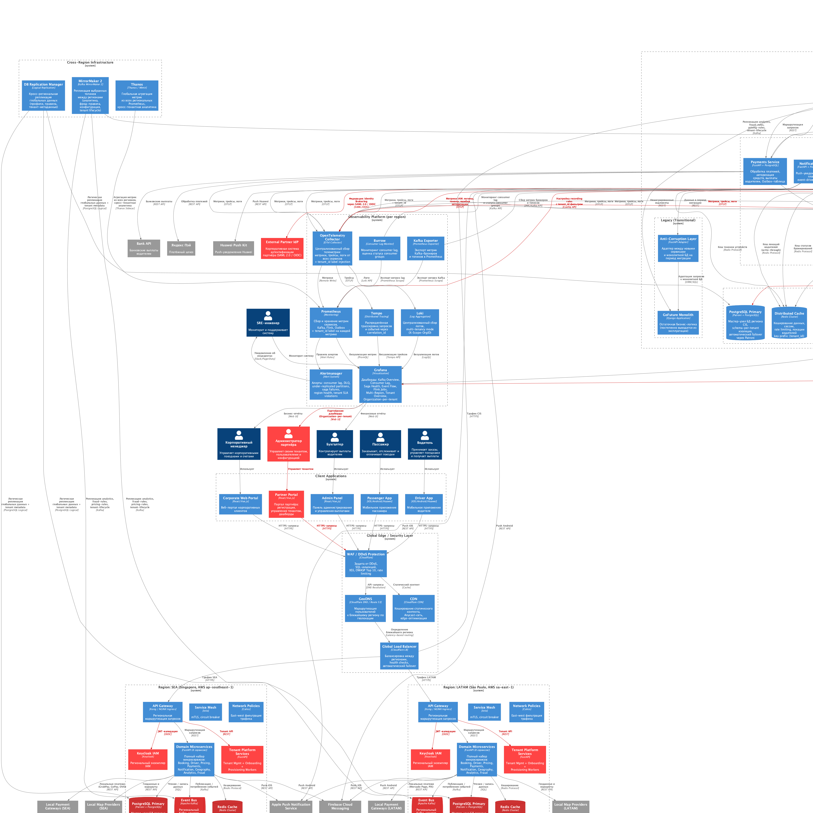
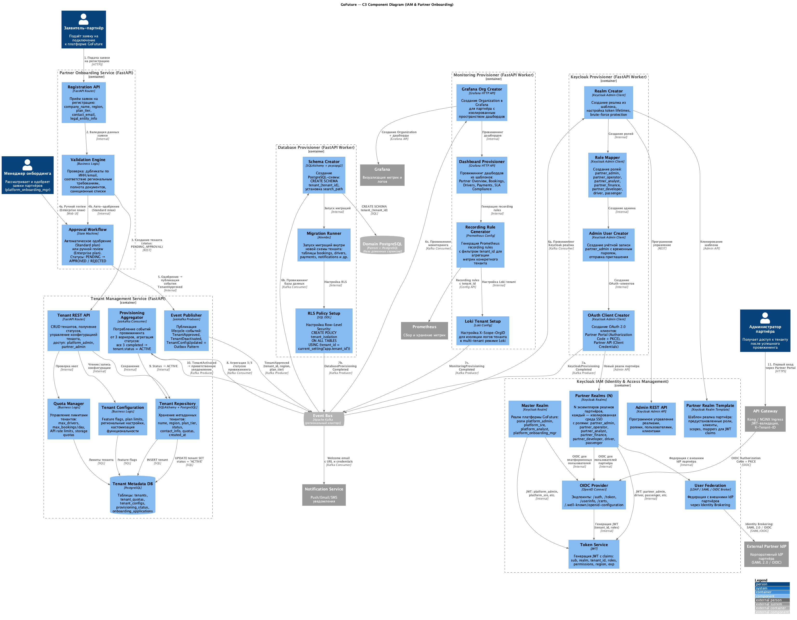

# Задание 4. Проектируем мультитенантную платформу

## Контекст

В рамках [Задания 1](../../task1/results/README.md) была выполнена декомпозиция монолита GoFuture на 8 доменных
микросервисов. В [Задании 2](../../task2/results/README.md) спроектирована событийная архитектура на базе Apache Kafka с
паттернами Choreography Saga, Transactional Outbox и полным стеком observability.
В [Задании 3](../../task3/results/README.md)
обеспечена высокая доступность (99,99%) и отказоустойчивость через мульти-региональное развёртывание в 3 регионах
(CIS / SEA / LATAM) с Cloudflare Edge, Patroni, MirrorMaker 2 и Thanos.

GoFuture стремится быстро запускать решения для партнёров в новых регионах с **полной изоляцией данных** и
**кастомизацией функциональности**. Для этого необходимо спроектировать мультитенантную платформу, включающую:

- Модель изоляции данных между партнёрами
- IAM-систему с ролевым доступом и SSO
- Автоматизированный процесс подключения новых партнёров (onboarding)
- Систему мониторинга мультитенантного окружения

---

## Решение — обзор

| Компонент                    | Решение                                                                                 | Обоснование                                                   |
|------------------------------|-----------------------------------------------------------------------------------------|---------------------------------------------------------------|
| IAM / SSO                    | Keycloak (Realm-per-tenant)                                                             | Полная изоляция SSO, федерация с корпоративными IdP партнёров |
| Аутентификация               | OIDC + OAuth 2.0 (Authorization Code + PKCE, Client Credentials)                        | Промышленный стандарт, поддержка web/mobile/API клиентов      |
| Токены                       | JWT с claims: tenant_id, roles, permissions, region                                     | Stateless валидация на API Gateway                            |
| Изоляция данных (PostgreSQL) | Schema-per-tenant (default), Database-per-tenant (enterprise)                           | Баланс между изоляцией и операционными затратами              |
| Изоляция данных (Kafka)      | Shared topics + tenant_id в ключах/заголовках                                           | Нет разрастания топиков, фильтрация на consumer-стороне       |
| Tenant Management            | FastAPI + PostgreSQL (метаданные тенантов)                                              | Жизненный цикл, квоты, конфигурация тенантов                  |
| Onboarding                   | FastAPI + Kafka (Choreography: 3 параллельных провижинера)                              | Децентрализованный подход, нет SPOF, масштабируется           |
| Аудит                        | Kafka → Audit Log Service → ClickHouse                                                  | Immutable audit trail, быстрые аналитические запросы          |
| Мониторинг                   | Prometheus (tenant_id label) + Grafana (Organization-per-tenant) + Loki (multi-tenancy) | Изоляция дашбордов, per-tenant SLI/SLO                        |

---

## 1. Модель изоляции данных между партнёрами

### 1.1 Стратегия по слоям данных

| Слой данных                    | Стратегия изоляции                             | Детали                                                                                                           |
|--------------------------------|------------------------------------------------|------------------------------------------------------------------------------------------------------------------|
| **PostgreSQL (транзакции)**    | Schema-per-tenant (default)                    | Каждый тенант — отдельная схема с идентичной структурой таблиц. Сервисы резолвят схему из JWT claim `tenant_id`. |
| **PostgreSQL (enterprise)**    | Database-per-tenant (опционально)              | Для партнёров с повышенными требованиями к изоляции — выделенная БД.                                             |
| **Apache Kafka**               | Shared topics + `tenant_id` в ключе/заголовках | Топики общие (как в Задании 2), фильтрация на стороне consumer. Ключ: `{tenant_id}:{region}:{aggregate_id}`.     |
| **Redis**                      | Key prefix `{tenant_id}:`                      | Общий Redis Cluster, пространство имён через префиксы ключей.                                                    |
| **Elasticsearch / OpenSearch** | Index-per-tenant `{tenant_id}-{index_name}`    | Отдельные индексы для геопоиска каждого партнёра.                                                                |
| **ClickHouse**                 | Shared tables + колонка `tenant_id`            | Кросс-тенантная агрегация для платформенных аналитиков, row-level фильтрация для партнёров.                      |
| **Object Storage (S3)**        | Prefix-per-tenant `s3://{bucket}/{tenant_id}/` | Документы партнёров, ML-модели, экспорты.                                                                        |

### 1.2 Сравнение стратегий изоляции PostgreSQL

| Критерий                        | Shared DB + `tenant_id` | Schema-per-tenant (выбрано)  | Database-per-tenant |
|---------------------------------|-------------------------|------------------------------|---------------------|
| **Сила изоляции**               | Слабая (row-level)      | Средняя (schema-level)       | Сильная (full)      |
| **Соответствие compliance**     | Сложно доказать         | Приемлемо                    | Проще всего         |
| **Изоляция производительности** | Нет                     | Частичная (connection pools) | Полная              |
| **Операционная стоимость**      | Низкая                  | Средняя                      | Высокая             |
| **Миграции (Alembic)**          | Одна миграция           | N миграций (по числу схем)   | N миграций (по БД)  |
| **Кросс-тенантные запросы**     | Просто                  | Средне (SET search_path)     | Сложно              |
| **Масштабируемость**            | До ~1000 тенантов       | До ~500 тенантов/инстанс     | До ~100 тенантов    |

**Решение**: Schema-per-tenant как основной подход — оптимальный баланс между изоляцией и операционной стоимостью.
Для enterprise-партнёров с жёсткими compliance-требованиями (например, 152-ФЗ для CIS) предлагается опция
Database-per-tenant.

### 1.3 Row-Level Security (RLS)

Дополнительный слой защиты через PostgreSQL RLS:

```sql
-- Политика изоляции на уровне строк
CREATE POLICY tenant_isolation ON bookings
    USING (tenant_id = current_setting('app.tenant_id')::uuid);

-- Установка контекста при подключении (из JWT claim)
SET app.tenant_id = '{tenant_id_from_jwt}';
```

Даже при ошибке в коде сервиса (забытый фильтр `WHERE tenant_id = ...`) RLS гарантирует, что тенант видит только свои
данные.

---

## 2. IAM-система с ролевым доступом и SSO

### 2.1 Архитектура IAM

**Identity Provider**: Keycloak — open-source IAM-платформа с полной поддержкой OIDC, OAuth 2.0, SAML 2.0.

**Стратегия изоляции**: **Realm-per-tenant** — каждый партнёр получает выделенный Keycloak Realm, обеспечивающий:

- Полную изоляцию пользователей, ролей, клиентов, сессий
- Независимую настройку SSO, MFA, password policies
- Возможность федерации с корпоративным IdP партнёра через Identity Brokering (SAML 2.0 / OIDC)

**Реалмы**:

- `GoFuture Master` — реалм платформы GoFuture (platform_admin, platform_sre, platform_analyst, platform_onboarding_mgr)
- `Partner Realm Template` — шаблон для быстрого создания новых реалмов партнёров
- `Partner-{tenant_id}` — N экземпляров реалмов, по одному на партнёра

### 2.2 Протоколы и потоки аутентификации

| Клиент         | Протокол / Grant               | Назначение                                  |
|----------------|--------------------------------|---------------------------------------------|
| Partner Portal | OIDC Authorization Code + PKCE | SSO для партнёрских администраторов         |
| Passenger App  | OIDC Authorization Code + PKCE | Аутентификация пассажиров                   |
| Driver App     | OIDC Authorization Code + PKCE | Аутентификация водителей                    |
| Partner API    | OAuth 2.0 Client Credentials   | Машинная интеграция (M2M) для разработчиков |
| Admin Panel    | OIDC Authorization Code + PKCE | SSO для платформенных администраторов       |
| Inter-service  | Istio mTLS + JWT propagation   | Доверенная коммуникация между сервисами     |

### 2.3 Структура JWT-токена

```json
{
  "iss": "https://auth.gofuture.app/realms/partner-abc",
  "sub": "550e8400-e29b-41d4-a716-446655440000",
  "aud": "gofuture-api",
  "realm": "partner-abc",
  "tenant_id": "partner-abc",
  "roles": [
    "partner_admin"
  ],
  "permissions": [
    "booking:read",
    "booking:write",
    "driver:read",
    "driver:write",
    "analytics:read"
  ],
  "region": "sea",
  "plan_tier": "standard",
  "iat": 1700000000,
  "exp": 1700003600
}
```

### 2.4 Интеграция с API Gateway

```
Client → Cloudflare WAF → GeoDNS → Global LB → API Gateway (Kong)
                                                      │
                                                      ├── JWT Validation (проверка подписи через JWKS endpoint Keycloak)
                                                      ├── Extract tenant_id из JWT claims
                                                      ├── Inject заголовок X-Tenant-ID
                                                      ├── Rate limiting per tenant_id
                                                      └── Route → Domain Microservice
```

API Gateway выполняет:

1. Валидацию JWT-подписи через JWKS endpoint Keycloak (`/.well-known/openid-configuration`)
2. Проверку `exp`, `aud`, `iss` claims
3. Извлечение `tenant_id` и `roles` из JWT
4. Инъекцию заголовка `X-Tenant-ID` для downstream-сервисов
5. Per-tenant rate limiting на основе `tenant_id` и `plan_tier`

---

## 3. Таблица ролей и уровней доступа

### 3.1 Платформенные роли (GoFuture Master Realm)

| Роль                      | Описание                    | Доступ к данным                           | API-эндпоинты                                      | Уровень изоляции                |
|---------------------------|-----------------------------|-------------------------------------------|----------------------------------------------------|---------------------------------|
| `platform_admin`          | Суперадминистратор GoFuture | Все тенанты, все данные                   | Все API + Tenant Mgmt + Keycloak Admin             | Кросс-тенантный                 |
| `platform_sre`            | SRE-инженер GoFuture        | Метрики, логи, трейсы всех тенантов       | Monitoring API, Alerting API, Grafana (Master Org) | Кросс-тенантный (observability) |
| `platform_analyst`        | Аналитик GoFuture           | Агрегированная аналитика по всем тенантам | Analytics API (read-only), ClickHouse              | Кросс-тенантный (аналитика)     |
| `platform_onboarding_mgr` | Менеджер онбординга         | Статусы онбординга, одобрение заявок      | Onboarding API, Tenant Mgmt API (limited)          | Кросс-тенантный (онбординг)     |

### 3.2 Партнёрские роли (Partner Realm)

| Роль                | Описание               | Доступ к данным                                      | API-эндпоинты                                              | Уровень изоляции      |
|---------------------|------------------------|------------------------------------------------------|------------------------------------------------------------|-----------------------|
| `partner_admin`     | Администратор партнёра | Все данные своего тенанта, управление пользователями | Tenant Admin API, User Mgmt, Config, Grafana (Partner Org) | Тенант-ограниченный   |
| `partner_operator`  | Оператор партнёра      | Поездки, водители, заказы своего тенанта             | Booking API, Driver API, Geography API (tenant-scoped)     | Тенант-ограниченный   |
| `partner_analyst`   | Аналитик партнёра      | Аналитика и отчёты своего тенанта                    | Analytics API (tenant-scoped, read-only)                   | Тенант-ограниченный   |
| `partner_finance`   | Финансовый менеджер    | Платежи, выплаты, финансовые отчёты своего тенанта   | Payments API (tenant-scoped, read-only), Finance Reports   | Тенант-ограниченный   |
| `partner_developer` | Разработчик партнёра   | API-доступ к данным своего тенанта                   | Partner Public API (Client Credentials, rate-limited)      | Тенант-ограниченный   |
| `driver`            | Водитель               | Свой профиль, назначенные поездки, навигация         | Driver App API (user-scoped)                               | Тенант + пользователь |
| `passenger`         | Пассажир               | Свои поездки, история, оплата                        | Passenger App API (user-scoped)                            | Тенант + пользователь |

### 3.3 Матрица доступа к доменным сервисам

| Сервис       | platform_admin | platform_sre | partner_admin | partner_operator | partner_analyst | partner_finance | partner_developer |  driver  | passenger |
|--------------|:--------------:|:------------:|:-------------:|:----------------:|:---------------:|:---------------:|:-----------------:|:--------:|:---------:|
| Booking      |       RW       | R (metrics)  |      RW       |        RW        |        R        |        —        |         R         | R (own)  | RW (own)  |
| Driver       |       RW       | R (metrics)  |      RW       |        RW        |        R        |        —        |         R         | RW (own) |     —     |
| Pricing      |       RW       | R (metrics)  |      RW       |        R         |        R        |        —        |         R         |    —     |     R     |
| Payments     |       RW       | R (metrics)  |       R       |        —         |        R        |        R        |         R         | R (own)  |  R (own)  |
| Notification |       RW       | R (metrics)  |      RW       |        R         |        —        |        —        |         —         | R (own)  |  R (own)  |
| Geography    |       RW       | R (metrics)  |      RW       |        RW        |        R        |        —        |         R         |    R     |     R     |
| Analytics    |       RW       | R (metrics)  |       R       |        R         |       RW        |        R        |         R         |    —     |     —     |
| Fraud        |       RW       | R (metrics)  |       R       |        —         |        R        |        —        |         —         |    —     |     —     |
| Tenant Mgmt  |       RW       | R (metrics)  |    R (own)    |        —         |        —        |        —        |         —         |    —     |     —     |

> R = Read, W = Write, RW = Read + Write, — = нет доступа, (own) = только свои данные

---

## 4. Автоматизированный процесс онбординга партнёров

### 4.1 Обзор процесса

Онбординг реализован по паттерну **Choreography** (аналогично Booking Saga из Задания 2) — 3 провижинера работают
параллельно, публикуя события завершения в Kafka. Tenant Management Service агрегирует статусы и переводит тенанта
в состояние `ACTIVE` после получения всех 3 событий.

### 4.2 Этапы онбординга

| #  | Этап                       | Компонент                  | Описание                                                                                   |
|----|----------------------------|----------------------------|--------------------------------------------------------------------------------------------|
| 1  | Подача заявки              | Partner Onboarding Service | Партнёр заполняет форму: company_name, region, plan_tier, contact_email, legal_entity_info |
| 2  | Валидация                  | Validation Engine          | Проверка дубликатов (ИНН/email), региональных требований, полноты документов               |
| 3  | Создание тенанта           | Tenant Management Service  | Запись в БД со статусом `PENDING_APPROVAL`                                                 |
| 4  | Одобрение                  | Approval Workflow          | **Standard план**: авто-одобрение. **Enterprise план**: ручной review менеджером           |
| 5  | Публикация события         | Event Publisher (aiokafka) | Событие `TenantApproved` в топик `platform.tenant.lifecycle.v1`                            |
| 6a | Провижининг Keycloak       | Keycloak Provisioner       | Создание реалма из шаблона, ролей, OAuth-клиентов, admin-пользователя                      |
| 6b | Провижининг БД             | Database Provisioner       | Создание PostgreSQL-схемы, Alembic-миграции, настройка RLS                                 |
| 6c | Провижининг мониторинга    | Monitoring Provisioner     | Создание Grafana Organization, дашборды из шаблонов, recording rules, Loki tenant          |
| 7  | Уведомление о завершении   | 3 Provisioner → Kafka      | Каждый публикует `{Step}ProvisioningCompleted` или `{Step}ProvisioningFailed`              |
| 8  | Агрегация                  | Provisioning Aggregator    | Ожидание 3/3 событий → обновление статуса тенанта                                          |
| 9  | Активация                  | Tenant Management Service  | Статус → `ACTIVE`, публикация `TenantActivated`                                            |
| 10 | Приветственное уведомление | Notification Service       | Email с URL портала, временным паролем, документацией по API                               |

### 4.3 Kafka-топики онбординга

| Топик                             | Publisher                 | Consumers                                                    |
|-----------------------------------|---------------------------|--------------------------------------------------------------|
| `platform.tenant.lifecycle.v1`    | Tenant Management Service | Keycloak Provisioner, DB Provisioner, Monitoring Provisioner |
| `platform.tenant.provisioning.v1` | Все 3 Provisioner         | Tenant Management Service (Provisioning Aggregator)          |
| `platform.audit.events.v1`        | Все платформенные сервисы | Audit Log Service → ClickHouse                               |

### 4.4 Обработка ошибок и компенсация

При сбое одного из провижинеров:

1. Провижинер публикует `{Step}ProvisioningFailed` с описанием ошибки
2. Provisioning Aggregator переводит тенанта в статус `PROVISIONING_FAILED`
3. Агрегатор публикует `TenantProvisioningFailed` — триггер компенсации
4. Каждый **успешно завершившийся** провижинер выполняет rollback:
    - Keycloak Provisioner → удаление реалма
    - DB Provisioner → DROP SCHEMA
    - Monitoring Provisioner → удаление Grafana Organization
5. Алерт в Alertmanager для `platform_onboarding_mgr`

### 4.5 Статусная модель тенанта

```
PENDING_APPROVAL → APPROVED → PROVISIONING → ACTIVE
                 ↘ REJECTED                ↘ PROVISIONING_FAILED → PENDING_APPROVAL (retry)
                                           
ACTIVE → SUSPENDED → ACTIVE (reactivation)
       ↘ DEACTIVATED (final)
```

---

## 5. Мониторинг мультитенантного окружения

### 5.1 Расширение стека observability

Существующий стек из Заданий 2-3 (Prometheus, Grafana, Loki, Tempo, Alertmanager, OTel Collector, Kafka Exporter,
Burrow,
Thanos) расширяется мультитенантными возможностями:

| Компонент          | Мультитенантное расширение                                                             |
|--------------------|----------------------------------------------------------------------------------------|
| **Prometheus**     | Label `tenant_id` на каждой метрике; recording rules per tenant для агрегации          |
| **Grafana**        | Organization-per-tenant: партнёр видит только свои дашборды. GoFuture Master Org — всё |
| **Loki**           | Multi-tenancy mode: заголовок `X-Scope-OrgID = tenant_id` для изоляции логов           |
| **Tempo**          | Тег `tenant_id` в span attributes для фильтрации трейсов по тенанту                    |
| **Alertmanager**   | Per-tenant routing: алерты по SLA нарушениям для конкретного тенанта                   |
| **Thanos**         | Глобальная агрегация кросс-региональных метрик с tenant_id label (из Задания 3)        |
| **OTel Collector** | Инъекция `tenant_id` label на этапе processing pipeline                                |

### 5.2 Метрики с tenant_id

Примеры метрик:

```
http_requests_total{service="booking", tenant_id="partner_abc", region="sea", method="POST", status="200"}
saga_duration_seconds{saga_type="booking", tenant_id="partner_abc", region="sea", quantile="0.99"}
events_published_total{tenant_id="partner_abc", event_type="BookingCreated", region="sea"}
keycloak_login_total{realm="partner-abc", result="success"}
keycloak_token_issued_total{realm="partner-abc", grant_type="authorization_code"}
tenant_provisioning_duration_seconds{tenant_id="partner_abc", step="keycloak"}
```

### 5.3 Per-tenant SLI/SLO

| SLI                             | SLO          | Метрика                                                     |
|---------------------------------|--------------|-------------------------------------------------------------|
| Время бронирования (end-to-end) | p99 < 10 сек | `saga_duration_seconds{saga_type="booking", tenant_id="X"}` |
| Авторизация платежа             | p99 < 3 сек  | `payment_authorization_duration_seconds{tenant_id="X"}`     |
| Доступность API                 | 99,95%       | `http_requests_total{tenant_id="X", status!~"5.."} / total` |
| Свежесть геолокации водителя    | p99 < 2 сек  | `driver_location_freshness_seconds{tenant_id="X"}`          |
| Доставка событий                | p99 < 1 сек  | `kafka_consumer_lag{consumer_group="booking-consumer-X"}`   |

### 5.4 Дашборды

| Дашборд             | Аудитория                 | Ключевые панели                                                         |
|---------------------|---------------------------|-------------------------------------------------------------------------|
| Tenant Overview     | `platform_admin`          | Количество активных тенантов, потребление ресурсов, воронка онбординга  |
| Tenant Health       | `platform_sre`            | Per-tenant SLI/SLO, error rates, latency heatmap по тенантам            |
| Partner Dashboard   | `partner_admin`           | Количество поездок, выручка, утилизация водителей, SLA compliance       |
| Partner Operations  | `partner_operator`        | Карта активных бронирований, доступность водителей, heat map цен        |
| Onboarding Pipeline | `platform_onboarding_mgr` | Воронка этапов онбординга, время провижининга, failure rate             |
| Audit Trail         | `platform_admin`          | Timeline действий администраторов, изменения ролей, конфигураций        |
| IAM Health          | `platform_sre`            | Логины/минуту по реалмам, ошибки аутентификации, token issuance rate    |
| Billing & Quotas    | `partner_admin`           | Использование квот (drivers, bookings/day, API calls), план тарификации |

### 5.5 Tenant-scoped алертинг

| Алерт                       | Условие                                                   | Получатель                       |
|-----------------------------|-----------------------------------------------------------|----------------------------------|
| Tenant SLA Violation        | `saga_duration_seconds{tenant_id="X"} p99 > 10s` за 5 мин | `platform_sre` + `partner_admin` |
| Tenant Error Rate Spike     | `http_5xx_rate{tenant_id="X"} > 5%` за 5 мин              | `platform_sre`                   |
| Tenant Quota Approaching    | Использование квоты > 80%                                 | `partner_admin`                  |
| Onboarding Failure          | `{Step}ProvisioningFailed` событие                        | `platform_onboarding_mgr`        |
| Keycloak Realm Anomaly      | Brute-force attempts > 100/мин на реалм                   | `platform_sre`                   |
| Cross-tenant Metric Anomaly | Отклонение метрик тенанта от baseline > 3σ                | `platform_sre`                   |

---

## 6. Связь с предыдущими заданиями

### 6.1 Расширение Event-Driven архитектуры (Задание 2)

| Аспект           | Задание 2                  | Задание 4                                                              |
|------------------|----------------------------|------------------------------------------------------------------------|
| Доменные события | 41 событие по 8 сервисам   | + `tenant_id` в Avro/Protobuf envelope каждого события                 |
| Kafka-топики     | 12 доменных топиков        | + 3 платформенных: tenant.lifecycle, tenant.provisioning, audit.events |
| Saga             | Choreography Booking Saga  | + Choreography Onboarding Saga (3 провижинера)                         |
| Outbox Pattern   | Для доменных сервисов      | + Для Tenant Management Service (lifecycle events)                     |
| Мониторинг       | 40+ метрик, 8 инструментов | + tenant_id label, per-tenant SLI/SLO, tenant-scoped алерты            |

### 6.2 Мульти-региональная интеграция (Задание 3)

| Аспект                  | Задание 3                       | Задание 4                                                                |
|-------------------------|---------------------------------|--------------------------------------------------------------------------|
| Keycloak                | —                               | Экземпляр в каждом регионе (CIS, SEA, LATAM)                             |
| Tenant metadata         | —                               | Логическая репликация PostgreSQL между регионами (как в Задании 3)       |
| Tenant lifecycle events | —                               | Репликация через MirrorMaker 2 (добавлен к реплицируемым топикам)        |
| Thanos                  | Глобальная агрегация метрик     | + кросс-тенантная и кросс-региональная аналитика                         |
| Failover                | DNS failover, Patroni, Sentinel | Keycloak session replication, tenant routing по primary region           |
| Провижининг             | —                               | Ресурсы создаются в primary-регионе тенанта, реплицируются автоматически |

---

## 7. Альтернативы

### 7.1 Изоляция данных

| Критерий               | Schema-per-tenant (выбрано)     | Shared DB + tenant_id  | Database-per-tenant      |
|------------------------|---------------------------------|------------------------|--------------------------|
| Сила изоляции          | Средняя                         | Слабая                 | Сильная                  |
| Операционная стоимость | Средняя                         | Низкая                 | Высокая                  |
| Compliance             | Приемлемо + RLS                 | Сложно доказать        | Проще всего              |
| Масштабируемость       | До ~500 тенантов/инстанс        | До ~1000 тенантов      | До ~100 тенантов         |
| **Вывод**              | Оптимальный баланс для GoFuture | Недостаточная изоляция | Для enterprise-партнёров |

### 7.2 IAM: Realm-per-tenant vs Single Realm

| Критерий          | Realm-per-tenant (выбрано)        | Single Realm + client isolation  |
|-------------------|-----------------------------------|----------------------------------|
| SSO-изоляция      | Полная (отдельные сессии)         | Частичная (общие сессии)         |
| Федерация с IdP   | Per-tenant (каждый свой IdP)      | Сложная настройка                |
| Password policies | Per-tenant                        | Единая для всех                  |
| Ресурсы Keycloak  | Выше (~50 МБ RAM / реалм)         | Ниже                             |
| **Вывод**         | Полная изоляция SSO для партнёров | Не подходит для B2B multi-tenant |

### 7.3 Онбординг: Choreography vs Orchestration

| Критерий        | Choreography (выбрано)              | Orchestration (central coordinator)  |
|-----------------|-------------------------------------|--------------------------------------|
| Связанность     | Слабая — воркеры независимы         | Сильная — оркестратор знает обо всех |
| SPOF            | Отсутствует                         | Оркестратор — единая точка отказа    |
| Согласованность | Решение из Задания 2 (Booking Saga) | Противоречит архитектурному выбору   |
| Отслеживание    | Aggregator + Kafka                  | Проще (логика в одном месте)         |
| **Вывод**       | Единообразие с Booking Saga         | Оправдано при >10 шагов              |

---

## 8. Компромиссы

| Компромисс                      | Преимущество                                     | Ограничение                                                      |
|---------------------------------|--------------------------------------------------|------------------------------------------------------------------|
| Schema-per-tenant + RLS         | Изоляция без полного дублирования инфраструктуры | Операционная сложность миграций на N схем                        |
| Realm-per-tenant                | Полная SSO-изоляция, федерация с внешними IdP    | Потребление ресурсов Keycloak растёт линейно с числом партнёров  |
| Shared Kafka topics + tenant_id | Нет разрастания топиков, простые операции        | Потенциальный noisy neighbor при высокой нагрузке одного тенанта |
| Choreography для онбординга     | Нет SPOF, единообразие с Booking Saga            | Сложнее отслеживать прогресс (решено Aggregator'ом)              |
| Grafana Organization-per-tenant | Полная изоляция дашбордов, нативный механизм     | Управление N организациями, обновление шаблонов дашбордов        |
| Prometheus tenant_id label      | Единый стек метрик, кросс-тенантные запросы      | High cardinality при >100 тенантов (митигация: recording rules)  |
| ClickHouse для аудита           | Быстрые аналитические запросы, immutable log     | Дополнительная инфраструктура (уже есть из Задания 2)            |

---

## Артефакты

| Артефакт                           | Файл                                                                                     | Описание                                                    |
|------------------------------------|------------------------------------------------------------------------------------------|-------------------------------------------------------------|
| C2-диаграмма Multi-Tenant Platform | [diagrams/puml/C2_multitenant_platform.puml](diagrams/puml/C2_multitenant_platform.puml) | C4 Container Diagram: IAM, онбординг, мониторинг, аудит     |
| C3-диаграмма IAM & Onboarding      | [diagrams/puml/C3_iam_onboarding.puml](diagrams/puml/C3_iam_onboarding.puml)             | C4 Component Diagram: детализация IAM и процесса онбординга |
| C2-диаграмма (PNG)                 | [diagrams/png/C2_multitenant_platform.png](diagrams/png/C2_multitenant_platform.png)     | Рендер C2 в формате PNG                                     |
| C3-диаграмма (PNG)                 | [diagrams/png/C3_iam_onboarding.png](diagrams/png/C3_iam_onboarding.png)                 | Рендер C3 в формате PNG                                     |

## Диаграмма C2 — Мультитенантная платформа



Диаграмма в формате `.puml`: [C2_multitenant_platform.puml](diagrams/puml/C2_multitenant_platform.puml)

### Ключевые отличия от C2 Task 3

| Элемент         | Task 3 (HA, Multi-Region)                            | Task 4 (Multi-Tenant Platform)                                  |
|-----------------|------------------------------------------------------|-----------------------------------------------------------------|
| IAM             | Не детализирован                                     | Keycloak (Realm-per-tenant), OIDC/OAuth 2.0, JWT с tenant_id    |
| Tenant Platform | —                                                    | Tenant Mgmt Service, Onboarding Service, 3 Provisioning Workers |
| Audit           | —                                                    | Audit Log Service + ClickHouse, immutable audit trail           |
| Kafka-топики    | 12 доменных + cross-region replication               | + 3 платформенных (lifecycle, provisioning, audit)              |
| Observability   | Prometheus + Thanos, per-region                      | + tenant_id labels, Grafana Org-per-tenant, Loki multi-tenancy  |
| Акторы          | 6 (Passenger, Driver, Manager, Accountant, Dev, SRE) | + Partner Admin, Partner Developer                              |
| Client Apps     | 4 (Passenger, Driver, Corporate, Admin)              | + Partner Portal                                                |
| Data Isolation  | По регионам                                          | + По тенантам (schema-per-tenant, key prefix, index-per-tenant) |

## Диаграмма C3 — IAM & Онбординг



Диаграмма в формате `.puml`: [C3_iam_onboarding.puml](diagrams/puml/C3_iam_onboarding.puml)

### Поток онбординга (пронумерован на диаграмме)

1. Заявитель подаёт заявку через Registration API
2. Validation Engine проверяет данные (дубликаты, compliance)
3. Создание записи тенанта в Tenant Metadata DB (status: `PENDING_APPROVAL`)
4. Одобрение: авто (Standard) или ручное (Enterprise)
5. Публикация `TenantApproved` в Kafka
6. Три провижинера параллельно создают ресурсы (Keycloak realm, DB schema, Grafana org)
7. Каждый провижинер публикует `{Step}ProvisioningCompleted`
8. Aggregator ожидает 3/3 событий
9. Тенант переводится в статус `ACTIVE`
10. Notification Service отправляет приветственное письмо
11. Администратор партнёра входит через Partner Portal (OIDC + PKCE)
